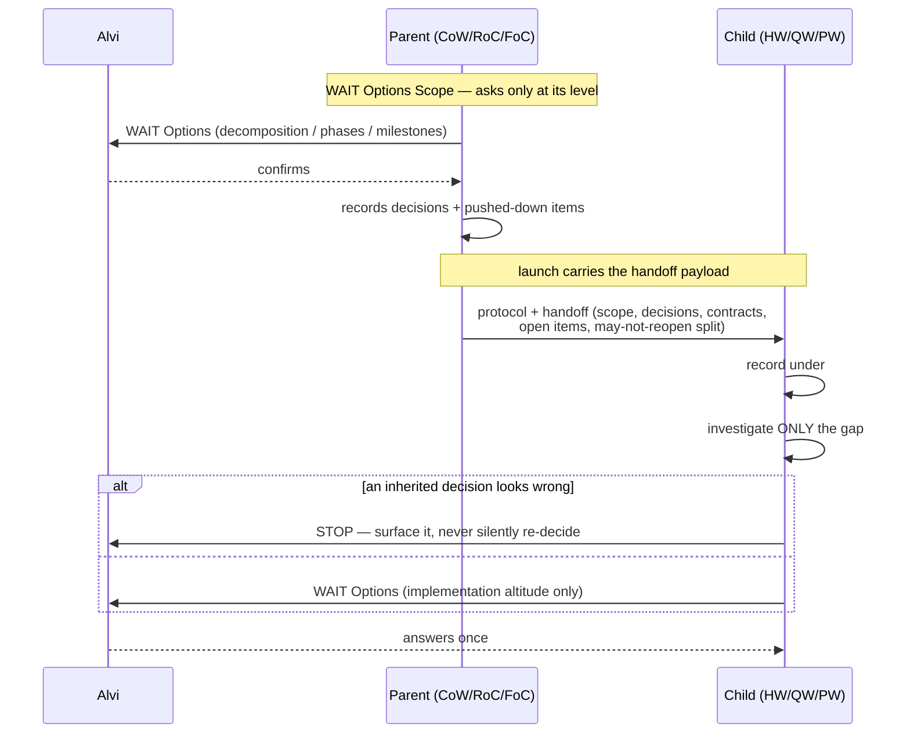

# High Wizard Plan

## **PROJECT INFO**
- **Project**: agent-memory-coding-skill
- **Date**: 2026-08-15
- **Agent**: meta
- **Theme**: Wizard altitude scoping + parent→sub-wizard handoff payload
- **Source Protocol**: `/high-wizard` — /high-wizard

*CRITICAL INSTRUCTION: To continue this plan: load the source protocol above, then inspect which sections below are filled vs unfilled to infer your current step.*

---

## **OBJECTIVES**
Close one design hole with two visible symptoms: the wizard hierarchy has levels, but (1) `/wait-options` states its technical-disclosure mandate absolutely, so parent wizards planning phases and milestones are pushed to ask implementation-level questions; and (2) the parent→child execute edge carries only a file path, so confirmed decisions, requirements and contracts never reach the sub-wizard, which re-investigates from zero and re-asks what was already settled.

Fix by keeping `/wait-options` **generic** (it must not know who called it) and moving level-awareness into each wizard as its own scope guidance, plus a real handoff payload on the parent→child edge.

### **Related Documents**
- [wait-options.md](../procedures/wait-options.md) - the shared format layer; 14 consumers, 5 of them not wizards
- [investigate-and-collect-decisions.md](../components/investigate-and-collect-decisions.md) - child-side entry, shared by `/high-wizard` + `/quick-wizard`
- [wizard-architecture.md](../../../Users/alvia/.claude/@agent-memory/agent-meta/knowledge-base/agent-memory/wizard-architecture.md) - agent-memory knowledge doc holding the level ladder (stale; missing Council row)

### **SUCCESS CRITERIA**
- [ ] `/wait-options` contains no wizard-level or caller-specific knowledge; its technical-disclosure rule reads relatively, not absolutely
- [ ] The inaccurate "core format is fixed — do not modify per-procedure" guidance is corrected
- [ ] Each of the 5 wizards declares its own WAIT-options scope guidance naming its level
- [ ] Level numbering is consistent across procedures and the knowledge doc (QW=0, HW=1, CoW=2, RoC=3, FoC=4), with the missing Council row added
- [ ] A parent launching a sub-plan passes a handoff payload (relevant decisions, requirements, integration contracts, open items); a child reads it before investigating and records it under `## INHERITED CONTEXT`
- [ ] `compile-procedures.py --strict` resolves clean and CI stays green

---

## **SCOPE**

### In Scope
- **`procedures/wait-options.md`** — genericize the mandatory technical-disclosure rule; correct the Customization Guidance
- **6 wizard procedures** — add per-level WAIT-options scope guidance to `/quick-wizard`, `/high-wizard`, `/pixel-wizard`, `/council-of-wizards`, `/rite-of-creation`, `/forge-of-covenant`; correct the level preambles
- **`/pixel-wizard` read side** — it keeps its own investigation variant, so the handoff-read step must be wired explicitly (it will not inherit it from the shared component)
- **Handoff component** — new reusable component defining the parent→child payload contract (write side + read side)
- **3 parent launch steps** — `council-of-wizards.md:195`, `rite-of-creation.md:181`, `forge-of-covenant.md:292` emit the payload
- **2 child entries** — `components/investigate-and-collect-decisions.md` (serving HW + QW) reads the payload before investigating
- **Plan templates** — `## INHERITED CONTEXT` section in `high-wizard-plan-template.md` and the `/quick-wizard` inline plan template
- **Knowledge doc** (memory-side, outside this repo) — fix the level ladder in `wizard-architecture.md` and add the missing Council row

### Out of Scope
- **A write side for `/pixel-wizard`** — it has no sub-plan or orchestration machinery; it is a leaf that receives a handoff but never emits one.
- **Verification of behavior** — no structural tests, no dogfood run; Alvi tests in field. This plan therefore ships **unverified at the behavioral level** (the compile/CI check only proves refs resolve).
- **The memory core (`control-files`)** — every file here is overlay-owned; the core invariant is untouched.
- **A public ladder table** — this repo has never documented the levels outside the parent preambles; adding one is scope creep, not part of this fix.
- **Scope blocks for the 5 non-wizard `/wait-options` consumers** (`analyze-code-quality`, `generate-{architecture,domain,flow}-docs`, `generate-standard`, `run-qa-test`) — they sit in no hierarchy and have no altitude to declare, so the genericized file serves them unchanged. Noted explicitly so their absence reads as a decision, not an oversight.
- **Retro-fitting completed plans** in `plans/completed/`.

---

## **CONFIRMED DECISIONS**
*These decisions were collected during investigation — both **asked-and-confirmed** by [USER-NAME] AND **written-through** (Zone A/B decisions made by the agent with reasoning, per /wait-options). The reasons serve as the analysis record.*

| # | Decision | Chosen | Reason |
|---|----------|--------|--------|
| 1 | Customization Guidance accuracy | **Correct it** — the "core format is fixed — do not modify per-procedure" line is inaccurate | It forbids exactly the per-caller variation the system needs, and contradicts the fix. Alvi: *"the wait options Customization Guidance is inaccurate. we should change that."* |
| 2 | Where level-awareness lives | **In each wizard, NOT in `/wait-options`** — the format file stays generic and caller-blind | Alvi: *"wait-options should not care where it is being called. it should be generic enough."* This overrides the agent's original recommendation of an altitude table inside `wait-options.md`. 14 procedures consume it and **5 are not wizards at all** (`analyze-code-quality`, `generate-{architecture,domain,flow}-docs`, `generate-standard`, `run-qa-test`) — a wizard-level ladder there would invert the dependency and need a row per consumer type. Same principle as the core/overlay boundary: a capability belongs where its entities live, and *levels are a wizard entity*. |
| 3 | The absolute disclosure mandate | **Restate relatively** — disclose the technical core *of the decision at hand*, not "main function/module entrypoints" unconditionally | Keeps the honest intent (never make silent commitments) without hard-coding an implementation-altitude vocabulary into a generic file. Follows from #2. |
| 4 | Per-wizard scope guidance | **Each of the 6 wizards declares what WAIT-options scope is necessary at its level, in the wizard PROCEDURE** (not the plan template) | Alvi: *"we should have scope guidance too in the wizard plan. what scope for the wait option is necessary at each level"*, clarified to *"yes, I mean in the wizard procedure"* — it is agent-facing instruction, paired against `wait-options.md`, not an artifact section. This is the positive half of the fix — #1/#3 remove the wrong pressure, #4 supplies the right target. |
| 5 | Level numbering | **Procedures win**: QW=0, HW=1, CoW=2, RoC=3, FoC=4; fix the knowledge doc and add the missing Council row. No ladder table in `/wait-options` (per #2) | The 3 parent preambles agree with each other and are Council-aware; `wizard-architecture.md` says QW=1/HW=2 and **has no Council row at all**, which is why everything below it shifted by one. |
| 6 | Handoff mechanism | **A reusable component** carrying the payload contract (write side + read side) | Alvi: *"A if it's already live inside component"* — verified live: `components/` holds 7 components, inlined into every caller at compile time, already consumed by HW Step 5 / QW Step 1. DRY at source, self-contained after inlining. |
| 7 | Where the child records inheritance | **New `## INHERITED CONTEXT` section**, separate from Confirmed Decisions | Provenance is the point: the child must see what it may **not** reopen. A "source" column in the existing table blurs that and is easy to ignore. |
| 8 | Deferred Decisions register | **Dropped** — parent-discovered open items ride in the handoff payload instead | Alvi: *"This is strange. The parent wizard should already giving scope."* Correct — the register was remedial for a parent that already strayed, and proper scope guidance (#4) prevents the condition. Conceded; the residual case (a genuine lower-altitude concern the parent spots) needs no new register, only a slot in the payload. |
| 9 | Payload contents | Relevant confirmed decisions + requirements + **integration contracts** + open items for this child | Alvi confirmed contracts belong in the payload (OQ2). A child that must honor `contracts/*.yaml` should be handed it, not left to find it by walking the plan folder. |
| 10 | `/pixel-wizard` | **Read side + scope guidance; no write side** | Corrected by Alvi (*"pixel-wizard still gets the handoff no?"*). The agent's first answer reasoned from what the parents' protocol lists currently say (none names pixel-wizard) and mistook an **omission for a boundary** — pixel-wizard shipped 2026-04-18, after CoW and RoC, and those lists were never updated. It is an HW *variant* using the **same plan template**, so it inherits `## INHERITED CONTEXT` from #7 automatically; but it keeps its **own investigation variant**, so the read step must be added explicitly rather than arriving via the shared component. No write side: verified it has no sub-plan or orchestration machinery, so it is a leaf that receives but never emits. Its rung is **1v** (HW variant) under the corrected numbering, not 2v. |
| 11 | Verification | **Deferred to field testing** — no structural tests, no dogfood run | Alvi: *"defer, I'll test in field directly."* Recorded explicitly because it means behavior is unverified at ship time; CI proves only that references resolve and the compile is clean. |
| 12 | Repo scope *(written through)* | Overlay only; memory core untouched | All target files are overlay-owned. `check-core-invariant.sh` guards core→overlay references; nothing here approaches it. |
| 13 | Parents' protocol lists | **Add `/pixel-wizard`** to all three parents' child-protocol lists + the CoW Sub-Plans Table Protocol column | Follows necessarily from #10: wiring a read side into a wizard no parent can assign would ship a path nothing can trigger — indistinguishable from not doing the work. A CoW splitting a feature into API + UI sub-plans can now route the UI one correctly. |

---

## **SOLUTION**

### Architecture Overview

Three layers, each owning exactly one thing — the split that makes `/wait-options` caller-blind:

| Layer | Owns | Must NOT know |
|---|---|---|
| **`/wait-options`** (format) | *How* to present a decision — zones, options, confidence, reason, open questions, reply instruction | Who called it, what level they are, what they should ask about |
| **Each wizard** (scope) | *Which* decisions belong at its level, and what to push down | How to format them |
| **`subplan-handoff` component** (transport) | *What* crosses the parent→child edge, and how a child consumes it | Either side's internal steps |

The governing sentence, added to `/wait-options`: **it defines how to present a decision; it never defines which decisions are yours — your procedure does.**

### Component 1: Genericized `/wait-options`
- **Purpose**: Remove the absolute implementation-altitude mandate that pushes parents to ask child-level questions, and correct the guidance that forbids per-caller scope variation.
- **Key Files**: [procedures/wait-options.md](../procedures/wait-options.md)
- **Four edits**:
  1. **Zone B row + How-to-Apply bullet** ([:18](../procedures/wait-options.md#L18), [:26](../procedures/wait-options.md#L26)) — "main function/module entrypoints, core algorithm, execution flow" → *the technical core the decision commits you to, at the altitude the decision lives*.
  2. **`### Critical Technical Disclosure (Mandatory)`** ([:53-61](../procedures/wait-options.md#L53-L61)) — keep the section and its intent (never make a silent commitment); demote its three implementation-flavoured items to *examples at implementation altitude*; state that the caller's procedure defines the altitude.
  3. **Per-Decision Format bullet** ([:82](../procedures/wait-options.md#L82)) — same relative restatement.
  4. **`## Customization Guidance`** ([:220-226](../procedures/wait-options.md#L220-L226)) — replace the inaccurate *"Core format… is fixed — do not modify per-procedure"* with the honest split: **format/shape is fixed** (options, confidence signals, reason, open questions, reply instruction, presentation style); **scope is caller-owned** (which decisions belong at this altitude).

### Component 2: Per-wizard scope guidance
- **Purpose**: Supply the positive target that Component 1 removes the wrong pressure for — each wizard states what to ask at its level and what to push down.
- **Key Files**: all six wizard procedures.
- **Shape**: one short `## WAIT Options Scope` block placed directly after each procedure's level preamble.

| Wizard | Level | Asks about | Pushes down |
|---|---|---|---|
| `/quick-wizard` | 0 | The concrete change — files, functions, approach | — (leaf) |
| `/high-wizard` | 1 | Implementation — modules, algorithms, integration points, contracts consumed | — (leaf) |
| `/pixel-wizard` | 1v | HW's scope + visual fidelity target, design source, screenshot tooling | — (leaf) |
| `/council-of-wizards` | 2 | Decomposition — sub-plan boundaries, integration contracts between them, parallelism, protocol per sub-plan | How any single sub-plan is built internally |
| `/rite-of-creation` | 3 | Phases — which apply, protocol + role per phase, exit criteria, dependencies | Feature decomposition (→ CoW), implementation (→ HW/QW/PW) |
| `/forge-of-covenant` | 4 | Milestones — vision, release boundaries, deferrals + debt, principles | Phase structure (→ RoC), decomposition (→ CoW), implementation |

Each block carries the same closing discipline, which is where dropped decision #8's residual goes: **a decision you push down does not disappear — record it in the handoff payload for the child that owns it.**

### Component 3: The `subplan-handoff` component
- **Purpose**: Give the parent→child edge a defined payload, and give the child a rule for consuming it that prevents both re-asking and silent contradiction.
- **Key Files**: `components/subplan-handoff.md` *(new)*
- **Write side (parent)** — when launching a sub-plan, emit a handoff block containing:
  1. the requirements/scope assigned to *this* child (R-IDs, phase, or milestone)
  2. confirmed decisions that **constrain** it — verbatim, with reasons
  3. integration contracts it must honor (`contracts/*.yaml` paths) *(decision #9)*
  4. open items the parent deliberately pushed down as this child's to decide
  5. an explicit **may-not-reopen vs your-call** split
- **Read side (child)** — before investigating:
  1. read the handoff; record it verbatim under `## INHERITED CONTEXT`
  2. **do not re-ask an inherited decision**
  3. if an inherited decision looks wrong, **STOP and surface it** — never silently re-decide
  4. investigate only the gap between what was inherited and what is still needed
- **Durability**: the launch context is the fast path, but a sub-plan always lives *inside its parent's folder*, so the child can always re-derive the handoff by reading the parent `core-plan.md`. This is what makes it survive a separate session — which matters because parallel sub-plan execution is an explicit feature of CoW/RoC/FoC.

### Component 4: Record sites + reachability
- **Purpose**: Give the child somewhere to record inheritance, and make pixel-wizard actually assignable.
- **Key Files**: [plan-templates/high-wizard-plan-template.md](../plan-templates/high-wizard-plan-template.md), [procedures/quick-wizard.md](../procedures/quick-wizard.md) (inline template), [plan-templates/council-of-wizards-plan-template.md](../plan-templates/council-of-wizards-plan-template.md), plus the three parents' protocol lists.
- `## INHERITED CONTEXT` goes after PROJECT INFO, before OBJECTIVES, defaulting to *"None — standalone plan"*. Pixel-wizard inherits this free via the shared HW template.

<!-- OPTIONAL SECTION A -->
### Integration Architecture

| Artifact | References / is referenced by | Direction of change | Depends on |
|---|---|---|---|
| `procedures/wait-options.md` | invoked by **14** procedures (6 wizards + `analyze-code-quality`, `generate-{architecture,domain,flow}-docs`, `generate-standard`, `run-qa-test`, + 2 components) | Genericized — **all 14 benefit, none break**, because nothing caller-specific is added | — |
| 6 wizard procedures | invoke `/wait-options`; parents also read `subplan-handoff` | Gain `## WAIT Options Scope`; parents gain the write side | wait-options edits landing first |
| `components/subplan-handoff.md` *(new)* | read by 3 parents (write side) + `investigate-and-collect-decisions` and `/pixel-wizard` (read side) | Created | — |
| `components/investigate-and-collect-decisions.md` | consumed by HW Step 5 + QW Step 1 | Gains a step 0 reading the handoff | component existing |
| `/pixel-wizard` | keeps its **own** investigation variant | Read side wired **explicitly** — it will not inherit from the shared component | component existing |
| `high-wizard-plan-template.md` | used by HW **and** pixel-wizard | Gains `## INHERITED CONTEXT` | — |
| 3 parents' protocol lists + CoW Sub-Plans Table | name the child protocols | Gain `/pixel-wizard` *(decision #13)* | — |

<!-- OPTIONAL SECTION B -->
### System Flow Diagrams

**Current State** — the parent asks at the wrong altitude, then hands over nothing but a path:

```mermaid
sequenceDiagram
    participant U as Alvi
    participant P as Parent (CoW/RoC/FoC)
    participant C as Child (HW/QW)
    Note over P: no scope guidance
    P->>U: WAIT Options (may include L1 implementation detail)
    U-->>P: confirms
    P->>P: records in Confirmed Decisions
    Note over P,C: launch carries ONLY a file path
    P->>C: /high-wizard (write your plan here)
    C->>C: investigate from zero
    C->>U: WAIT Options — re-asks what P already settled
    U-->>C: answers again (may contradict; nothing detects it)
```

**End Result** — the parent asks at its own altitude and hands over a payload:



<!-- OPTIONAL SECTION C -->
### Technical Considerations

- **Compile-time inlining multiplies the component**: components are inlined into *every* caller at compile time, so `subplan-handoff.md` ships its full text into 5–6 commands. Keep it tight — this is a size constraint, not just a style preference.
  - Upside: `compile-procedures.py --strict` fails on any unresolved component reference, so **wiring** is automatically checked by CI even though behavior is not.
- **`/wait-options` has 14 consumers, 5 of them non-wizards**: the genericization must be a *pure relaxation*. Nothing wizard-specific may enter the file, or `analyze-code-quality` / the `generate-*` family / `run-qa-test` inherit vocabulary that does not apply to them.
- **Don't-over-DRY tension** (the 2026-08-07 guardrail): the write and read halves are content-variant, which is the classic false-DRY trap. They are single-homed here because they share one thing that must not drift — the *definition of what a payload contains*. If in practice they stop sharing that, splitting into two components is the clean fallback.
- **`/pixel-wizard` is a standing duplication point**: it keeps its own investigation variant by design, so the read step must be wired into it explicitly and will drift from `investigate-and-collect-decisions.md` if either side changes later. This is pre-existing, not introduced here — but this change adds a second reason to keep them in sync.
- **Behavior is not verified at ship time** (decision #11): CI proves references resolve and the compile is clean. It proves nothing about whether a wizard actually asks at the right altitude or a child actually honors a handoff. Field testing is the verification.
- **Installed commands stay stale until compiled + installed**: editing `procedures/` changes nothing live until `setup-all-claude-code.py` runs (now ~0.6s after the 2026-08-15 Python migration).

---

## **IMPLEMENTATION PHASES**

> **Ordering rationale**: Phase 1 first because every wizard's scope block is written *against* the relaxed rule — writing scope guidance while the absolute mandate still stands would produce blocks that contradict the file they point at. Phase 3 needs the component to exist before wiring. Phases 4 and 5 are independent of each other but both depend on 3.
>
> **A note on every "Testing" line below**: per decision #11, verification is deferred to field use. What these steps can honestly check is *structural* — references resolve, the compile is clean, no placeholder survives, no contradictory sentence remains. None of it proves a wizard behaves differently. Do not write "verified" in the Execution Log for anything beyond what was actually checked.

### Phase 1: Genericize `/wait-options`

- [ ] **Step 1.1**: Relax the technical-disclosure mandate from absolute to relative
  - **Action**: Edit the four disclosure sites in [procedures/wait-options.md](../procedures/wait-options.md) so none of them names implementation-altitude artifacts as a universal requirement.
  - **Implementation**: (a) Zone B row `:18` and the How-to-Apply bullet `:26` — replace "main function/module entrypoints, core algorithm, and critical execution flow" with *the technical core the decision commits you to, at the altitude the decision lives*. (b) `### Critical Technical Disclosure (Mandatory)` `:53-61` — keep the section and its intent ("do not hide these just because there is no ambiguity"); demote its three items to **examples at implementation altitude**; add that the **caller's procedure defines the altitude**. (c) Per-Decision Format bullet `:82` — same relative restatement.
  - **Testing**: `grep -n "main function\|module entrypoint\|execution flow" procedures/wait-options.md` returns only lines explicitly marked as examples. Confirm no wizard name, level number, or procedure name appears anywhere in the file.
  - **Success Criteria**: The mandate still forbids silent commitments, but no longer prescribes implementation vocabulary to a caller planning milestones.

- [ ] **Step 1.2**: Correct the Customization Guidance and add the governing sentence
  - **Action**: Replace the inaccurate fixed-format claim and state the file's boundary once, plainly.
  - **Implementation**: In `## Customization Guidance` `:220-226`, replace *"Core format… is fixed — do not modify per-procedure"* with the honest split — **fixed**: options, confidence signals, per-option analysis, reason, open questions, reply instruction, presentation style; **caller-owned**: which decisions belong at this altitude. Add near the top of the file: *"This file defines **how** to present a decision. It never defines **which** decisions are yours — your procedure does."*
  - **Testing**: Re-read the file end-to-end for self-contradiction: the new governing sentence must not be undercut by any surviving "always ask X" phrasing.
  - **Success Criteria**: A parent wizard can scope its own WAIT options without contradicting the format reference.

### Phase 2: Per-wizard scope guidance

- [ ] **Step 2.1**: Add level preamble + `## WAIT Options Scope` to the three leaves
  - **Action**: Add the block to [quick-wizard.md](../procedures/quick-wizard.md), [high-wizard.md](../procedures/high-wizard.md), [pixel-wizard.md](../procedures/pixel-wizard.md).
  - **Implementation**: These three have **no level preamble at all** — add one (QW=0, HW=1, PW=1v) plus the scope block from the Solution table. Leaves have nothing to push down; say so explicitly rather than omitting the line, so the absence reads as deliberate.
  - **Testing**: `grep -c "WAIT Options Scope" procedures/*wizard*.md` → 1 per wizard file. Confirm PW's rung reads **1v** and not 2v.
  - **Success Criteria**: Each leaf states its level and what it asks about.

- [ ] **Step 2.2**: Add `## WAIT Options Scope` to the three parents + fix the preamble imprecision
  - **Action**: Add the block to [council-of-wizards.md](../procedures/council-of-wizards.md), [rite-of-creation.md](../procedures/rite-of-creation.md), [forge-of-covenant.md](../procedures/forge-of-covenant.md), each with its **push-down** row and the closing discipline line.
  - **Implementation**: Scope content per the Solution table. Each block ends with: *"A decision you push down does not disappear — record it in the handoff payload for the child that owns it."* Also fix [council-of-wizards.md:18](../procedures/council-of-wizards.md#L18), which groups QW under "Level 1" — QW is Level 0.
  - **Testing**: Read all three preambles together and confirm the ladder is internally consistent (0/1/1v/2/3/4). Confirm each push-down row names a *protocol*, not a vague "later".
  - **Success Criteria**: Every parent states what it must NOT ask about, and where that decision goes instead.

### Phase 3: The handoff component and its wiring

- [ ] **Step 3.1**: Create `components/subplan-handoff.md`
  - **Action**: Write the component with clearly labelled write and read halves.
  - **Implementation**: Follow the existing component conventions (see [investigate-and-collect-decisions.md](../components/investigate-and-collect-decisions.md)) — open with the "this is a component, not a standalone skill" note and name its consumers. Write side: the 5 payload items from the Solution. Read side: the 4 consumption rules, including **STOP and surface** rather than silently re-decide. State the durability rule: a sub-plan lives inside its parent's folder, so the parent `core-plan.md` is always the fallback source.
  - **Testing**: Keep it tight — it inlines into 5–6 commands. Check the byte count against the other components; if it is materially larger than the largest existing one, cut prose.
  - **Success Criteria**: A child reading only this component knows what it inherited, what it may not reopen, and what to do if it disagrees.

- [ ] **Step 3.2**: Wire the write side into the three parents
  - **Action**: Amend the launch steps that currently pass only a path.
  - **Implementation**: [council-of-wizards.md:195](../procedures/council-of-wizards.md#L195), [rite-of-creation.md:181](../procedures/rite-of-creation.md#L181), [forge-of-covenant.md:292](../procedures/forge-of-covenant.md#L292) — each gains "read and follow the Subplan Handoff component (write side)" alongside the existing path instruction. Keep the path instruction; it is still correct, just insufficient.
  - **Also wire the de-escalation branches**: [council-of-wizards.md:83](../procedures/council-of-wizards.md#L83), [rite-of-creation.md:90](../procedures/rite-of-creation.md#L90) and `:96`, [forge-of-covenant.md:203](../procedures/forge-of-covenant.md#L203) already say decisions "carry forward" in prose — that is the same handoff, described informally. Point them at the component too, so one contract covers both the sideways and downward edges instead of two mechanisms drifting apart.
  - **Testing**: `grep -n "subplan-handoff" procedures/{council-of-wizards,rite-of-creation,forge-of-covenant}.md` → at least two hits each (launch + de-escalation).
  - **Success Criteria**: No parent can hand off to another wizard — downward or sideways — while passing only a file path.

- [ ] **Step 3.3**: Wire the read side into the children
  - **Action**: Add the handoff read as the first thing a child does, before investigating.
  - **Implementation**: Add a **step 0** to [investigate-and-collect-decisions.md](../components/investigate-and-collect-decisions.md) (serves HW + QW): *"If launched as a sub-plan, read the parent's handoff first and record it under `## INHERITED CONTEXT`; investigate only the gap."* Then wire the same explicitly into [pixel-wizard.md](../procedures/pixel-wizard.md), which keeps its own investigation variant and will **not** inherit this.
  - **Testing**: `grep -rn "subplan-handoff" components/ procedures/pixel-wizard.md` → present in both. Re-read the component's own consumer note and update it if the consumer set changed.
  - **Success Criteria**: All four child paths (HW, QW, PW, and any future consumer of the shared component) read the handoff before investigating.

### Phase 4: Record sites and reachability

- [ ] **Step 4.1**: Add `## INHERITED CONTEXT` to both plan templates
  - **Action**: Give the child a place to record what it inherited.
  - **Implementation**: In [high-wizard-plan-template.md](../plan-templates/high-wizard-plan-template.md), insert after `## PROJECT INFO` and before `## OBJECTIVES`, defaulting to *"None — standalone plan"*. Mirror it in the `/quick-wizard` inline plan template at [quick-wizard.md:131](../procedures/quick-wizard.md#L131). Pixel-wizard needs no separate edit — it uses the HW template.
  - **Testing**: Confirm the section is distinct from `## CONFIRMED DECISIONS` and says plainly that inherited decisions are not the child's to reopen.
  - **Success Criteria**: A filled child plan shows inherited and self-made decisions as visibly different things.

- [ ] **Step 4.2**: Add `/pixel-wizard` to the parents' protocol lists *(decision #13)*
  - **Action**: Make the read side reachable.
  - **Implementation**: [council-of-wizards.md:114](../procedures/council-of-wizards.md#L114) (decomposition guidelines) and `:195` (launch), [rite-of-creation.md:71](../procedures/rite-of-creation.md#L71) and `:181`, [forge-of-covenant.md:292](../procedures/forge-of-covenant.md#L292); plus the Protocol column in [council-of-wizards-plan-template.md](../plan-templates/council-of-wizards-plan-template.md) (`HW / QW` → `HW / QW / PW`).
  - **⚠️ Overlap with Step 3.2**: the launch lines `:195` / `:181` / `:292` are edited by **both** steps. Apply this step's list edit in the *same pass* as 3.2 rather than reopening the same lines twice — double-editing the same line across steps is how one of the two silently gets reverted.
  - **Testing**: `grep -rn "pixel-wizard" procedures/{council-of-wizards,rite-of-creation,forge-of-covenant}.md plan-templates/council-of-wizards-plan-template.md` — every child-protocol list found in Phase 3.2 now includes it. Add a one-line note on *when* to pick it (visual/design-driven deliverable), so it is not offered blindly.
  - **Success Criteria**: A parent can assign a visual sub-plan to pixel-wizard, and the read side is no longer dead code.

### Phase 5: Compile, install, and the memory-side fix

- [ ] **Step 5.1**: Compile, lint, test, install
  - **Action**: Make the edits live and prove the wiring resolves.
  - **Implementation**: `ruff check .` → `pytest` (24 tests) → `python setup-scripts/compile-procedures.py --strict` → `python setup-scripts/setup-all-claude-code.py`. The `--strict` flag is what proves every new component reference resolves.
  - **Testing**: `--strict` exits 0; installed command count matches the installer's report; spot-check one compiled parent and one compiled child in `output/` to confirm the component text actually inlined rather than leaving a path.
  - **Success Criteria**: CI-equivalent checks green locally and the live commands carry the change.

- [ ] **Step 5.2**: Fix the level ladder in the knowledge doc *(memory-side)*
  - **Action**: Correct [wizard-architecture.md](../../../Users/alvia/.claude/@agent-memory/agent-meta/knowledge-base/agent-memory/wizard-architecture.md) — this is in the agent-memory store, **not this repo**.
  - **Implementation**: Renumber the QUICK REFERENCE table to QW=0, HW=1, PW=1v, RoC=3, FoC=4, and **add the missing `/council-of-wizards` = Level 2 row** — its absence is why the numbering drifted. Note that pixel-wizard is now assignable as a sub-plan.
  - **Testing**: Cross-read against the six procedure preambles; the two sources must agree rung for rung.
  - **Success Criteria**: One consistent ladder across procedures and memory.

---

## **EXECUTION LOG**
**Execution Protocol for AI**:
I have to use this document as my **ONLY** source of truth to execute and track the plan steps iteratively. I should **NOT** use additional tools like ToDos because it lacks the context of what should I do. Everytime I want to implement a step I have to check the reference to the original step plan above. Everytime a step has been finished I need to go back to this document to log what was done.
*In other words*:
- I have to make this document as the source of truth for the implementation phase on what I have worked on and what I will be working
- The original plan must be fully in my context, therefore, I have to make sure I loaded the **Plan File** before executing any task and read carefully the reference to the original step
- I have to do the implementation by doing it in order per step THEN, I ALWAYS have to fill the step log rightly after

**Definition of Done (applies to ALL steps)**:
- ✅ **Code Quality**: Code compiles/runs without errors
- ✅ **Testing**: Tests written and passing
- ✅ **Logged**: Implementation and testing logged below
- 🚫 **Blocked**: Get input from [USER-NAME] before assuming

> **Honesty rule for this log** (decision #11): behavior is not verified in this plan. Record in **Testing Log** only what was actually run — a grep, a `--strict` exit code, a re-read. Never write "verified" for altitude or handoff *behavior*; that is field testing, and it happens after this plan closes.

### Phase 1: Genericize `/wait-options`
- [x] **Step 1.1**: Relax the disclosure mandate
  - **Implementation Log**: Edited **5 sites**, not the 4 the plan enumerated. (a) Zone B row → "the mechanism the decision commits to, at the altitude the decision lives". (b) How-to-Apply bullet → "surface the mechanism the decision actually commits to, expressed at the altitude the decision lives"; also dropped "architectural commitments" for "a commitment [USER-NAME] cannot see" (narrower word was doing altitude-specific work). (c) `### Critical Technical Disclosure (Mandatory)` — kept the section and its intent, added the governing paragraph *"Express it at the altitude the decision lives. The calling procedure defines that altitude; this file does not."* + the premature-commit/invented-detail rationale, and demoted the 3 items under "At implementation altitude, for example". (d) Per-Decision Format bullet → "whenever the decision commits to a mechanism — expressed at the altitude that decision lives". **(e) NOT IN THE PLAN — found during execution**: the Standard Response Template carried a 5th copy of the same absolute phrasing (*"Include critical technical points (main function/module, core algorithm, key execution flow)"*); relaxed identically, and changed "evidence from codebase" → "evidence found" since a milestone decision has no codebase evidence.
  - **Testing Log**: `grep -n "main function\|module entrypoint\|execution flow"` → **2 hits, lines 61 and 63 only**, both inside the "At implementation altitude, for example" list. `grep -niE "wizard|Level [0-4]|council|rite-of|forge|pixel"` → **1 hit, line 3**: the file's own audience sentence ("used across all wizard protocols and quality procedures"). Judged PASS — it is a descriptive statement of who consumes the file, contains no procedure name, level number, or per-caller rule. Flagging rather than silently passing my own test.
  - **Success Criteria**: **Pass** — the mandate still forbids silent commitments; it no longer prescribes implementation nouns to a caller planning milestones.
  - **Tech Debts**: None.
  - **Result**: 5/5 disclosure sites relaxed. The plan's "four edits" undercounted by one — the response template is a real disclosure site and would have shipped the old rule verbatim into every WAIT presentation.

- [x] **Step 1.2**: Correct Customization Guidance + governing sentence
  - **Implementation Log**: Added the governing statement at the top of the file (line 7): *"This file defines HOW to present a decision. It never defines WHICH decisions are yours — your procedure does"* + the caller-blind clause. Rewrote `## Customization Guidance` from a flat 5-bullet list into an explicit **shape vs scope** split — *Fixed* (core format, presentation style, reply instruction) vs *Caller-owned* (scope, technical-disclosure vocabulary, preamble, context grouping). The inaccurate *"Core format… is fixed — do not modify per-procedure"* is gone as a blanket claim; the fixed list now says what is fixed **and** the caller-owned list says explicitly *"do not read the fixed shape above as a claim that it can [know your scope]"*.
  - **Testing Log**: End-to-end re-read for contradiction. Two surviving "always" rules checked individually: *"Always disclose technical core (Zone B)"* and *"Always ask Zone E"* — **both compatible**, because each fires on a decision you already hold rather than asserting which decisions you hold. **One real blur found and fixed**: the What-to-Surface intro said the taxonomy decides "which decisions to surface", which reads as scope. Tightened to "which of *your* decisions", plus an explicit italic note that the taxonomy classifies a decision you already hold and that a decision not yours at this altitude *"should not be zoned here at all — it should be handed to whoever owns it."* That sentence also pre-wires the handoff concept Phase 3 builds.
  - **Success Criteria**: **Pass** — a parent can now bound its own decision set without contradicting this file.
  - **Tech Debts**: None.
  - **Result**: `/wait-options` is caller-blind and internally consistent. Phase 2's scope blocks now have a non-contradicting file to point at, which was the reason for this ordering.

### Phase 2: Per-wizard scope guidance
- [x] **Step 2.1**: Level preamble + scope block — QW, HW, PW
  - **Implementation Log**: Added a level preamble (none of the three had one) + a `## WAIT Options Scope` block to each. QW = **Level 0**, HW = **Level 1**, PW = **Level 1v**. Each block opens by restating the boundary (*"`/wait-options` defines how to present a decision; it does not define which decisions are yours"*) then gives **Ask about** / **Technical disclosure vocabulary** / **Push down**. All three state *"Push down: nothing. This is a leaf"* explicitly, so the absence reads as deliberate. Two things added beyond the plan's letter, both consequences of it: (a) each preamble names that the wizard **may be launched as a sub-plan**, and HW/PW carry a "**Launched as a sub-plan?**" line telling them the parent already settled boundary/contract decisions — this is the scope-side half of Phase 3's read side, and without it the scope block would read as if the child owns every decision in its own set; (b) QW's push-down line points at its **scope gate** (escalate to `/high-wizard`) rather than at a handoff, since a leaf with no lower altitude has no one to defer to — the failure mode there is under-escalation, not mis-delegation.
  - **Testing Log**: `grep -c '^## WAIT Options Scope'` → **1 each** for quick-wizard, high-wizard, pixel-wizard (parents 0, correct at this step). `grep -n "This is a \*\*Level"` → confirms **Level 0 / Level 1 / Level 1v**; PW reads **1v**, not the stale 2v.
  - **Success Criteria**: **Pass** — each leaf states its level, what it asks about, and that it has nothing to push down.
  - **Tech Debts**: None. *(Initially logged one here — that PW's scope block is a hand-written delta on HW's and won't follow automatically. Reclassified: PW keeping its own variant is its design, so this is a pixel-wizard property to be aware of when editing HW, not work owed.)*
  - **Result**: Three leaves scoped. PW additionally gained a note that its design reference may arrive via the handoff, so the Visual Design Gate should check there before failing.

- [x] **Step 2.2**: Scope block — CoW, RoC, FoC + preamble fix
  - **Implementation Log**: Added `## WAIT Options Scope` to all three parents with **Ask about** / **Technical disclosure vocabulary** / **Push down**, each closing on *"A decision you push down does not disappear — record it in the handoff payload for the child that owns it."* Each push-down line carries the *reason* it is wrong to decide here, not just the boundary: CoW *"commits the child before it has investigated, and the child will re-ask anyway"*; RoC *"decides for a phase that has not been investigated yet"*; FoC *"a stack or module choice is a guess about work three levels down."* Fixed the planned CoW preamble imprecision — it grouped QW under "Level 1"; it now reads Level 1 (`/high-wizard`), Level 1v (`/pixel-wizard`), Level 0 (`/quick-wizard`). Bolded the level in all three preambles for consistency with the leaves. FoC's closing line additionally names its existing **Deferral & Debt Tracker** as the milestone-scoped form of the same discipline, tying the new rule to the precedent that justified it (decision #8).
  - **Testing Log**: `grep -c '^## WAIT Options Scope'` → **1 for all six wizards**. Ladder read across all six preambles: **0 / 1 / 1v / 2 / 3 / 4** — consistent, no gaps, no duplicates. Push-down check **initially FAILED for CoW**: it said work belongs to *"that sub-plan's own wizard"* — a category, not a named protocol, while RoC and FoC named theirs. Fixed to name `/high-wizard`, `/pixel-wizard`, `/quick-wizard` explicitly, then re-ran: all six push-down lines now name protocols or state "nothing — leaf".
  - **Success Criteria**: **Pass** — every parent states what it must NOT ask about and names where that decision goes.
  - **Tech Debts**: None.
  - **Result**: All six wizards scoped; the ladder is now declared in the procedures themselves rather than inferable only from three parent preambles. The three parents' preambles now also name `/pixel-wizard` as an assignable child — which is part of Step 4.2's work, landed early here because the preamble sentence had to be rewritten anyway.

### Phase 3: Handoff component and wiring
- [x] **Step 3.1**: Create `components/subplan-handoff.md`
  - **Implementation Log**: Created with the standard component header (*"this is a component, not a standalone skill"* + named consumers) and a one-line statement of the failure it prevents. **Write side** = the 5 payload items, with two refinements made while writing: item 2 requires decisions quoted *verbatim with their reasons* (*"a bare verdict invites"* re-litigation — the reason is the load-bearing part), and item 5 requires an explicit **settled vs your-call** split because *"an unlabelled payload reads as entirely fixed, and the child stops thinking"* — the opposite failure from the one being fixed, and worth naming. Added a scoping instruction at the top of the write side: include only what bears on **this** child, since *"a payload that restates the whole parent plan is noise, and noise gets skimmed."* **Read side** = the 4 consumption rules, with rule 3's rationale spelled out (a silent override *"produces two plans that disagree, and nothing in the system compares them"*). Closed with the durability fallback (parent `core-plan.md` beside you, which matters because parallel execution is normal and the launch context does not survive a separate session) and an explicit standalone case → write *"None — standalone plan"*.
  - **Testing Log**: **3131 bytes**. Compared against the existing set: larger than `investigate-and-collect-decisions.md` (2319) but well under `build-riao-mechanisms.md` (4804), making it the 2nd largest of 8. Test criterion was "cut prose if materially larger than the largest existing" — not triggered, no cut needed.
  - **Success Criteria**: **Pass** — a child reading only this component knows what it inherited, what it may not reopen, and what to do if it disagrees.
  - **Tech Debts**: None.
  - **Result**: The payload contract exists in one place. Write and read halves are single-homed, per decision #6's reasoning that what must not drift is the *definition of what a payload contains*.

- [x] **Step 3.2**: Wire write side into 3 parents *(+ Step 4.2's list edits, applied in the same pass per the overlap warning)*
  - **Implementation Log**: Wired the **write side** into all four launch/de-escalation shapes: CoW Step 16.2 (launch) + Step 7 de-escalation→HW; RoC Step 15.2 (launch) + **both** Step 7 de-escalations (→CoW and →HW); FoC Step 12 (launch) + Step 10 de-escalation→RoC. Each launch keeps its original path instruction — still correct, just insufficient — and now closes on **"A path alone is not a handoff."** Each de-escalation branch replaces the informal *"decisions carry forward"* prose with the component reference plus the reason: *"De-escalation is a handoff too; use the same contract rather than an informal summary."* **Step 4.2 landed here too** (same lines, per the plan's overlap warning): `/pixel-wizard` added to every child-protocol list — CoW Step 10 guidelines + Step 16.2, RoC Step 7.2 phase menu + Step 15.2, FoC Step 11 milestone discussion + Step 12. Every mention carries a **when-to-pick** qualifier (*"when the deliverable is design-driven and has a visual reference to match"*) so it is not offered blindly, which was 4.2's stated testing requirement.
  - **Testing Log**: `grep -c 'subplan-handoff'` → CoW **2**, RoC **3**, FoC **2** — matching each parent's actual edge count (RoC has two de-escalation branches, not one). Negative check `grep -n "Launch \`/" … | grep -v subplan-handoff` → **empty**, so no launch or de-escalation anywhere still passes only a path. `grep -c pixel-wizard` → CoW **4**, RoC **4**, FoC **3**.
  - **Success Criteria**: **Pass** — no parent can hand off to another wizard, downward or sideways, while passing only a file path.
  - **Tech Debts**: None.
  - **Result**: Both edges use one contract. The de-escalation wiring (the auto-fix flagged at final review) turned out to matter more than expected — RoC alone had two such branches, so the informal path was three sites wide across the parents, not one.

- [x] **Step 3.3**: Wire read side into shared component + pixel-wizard
  - **Implementation Log**: Added checklist **step 0 "Inherited context"** to `investigate-and-collect-decisions.md` (serving HW + QW) and, separately, to `/pixel-wizard`'s own investigation variant at its Step 6. Both read the Subplan Handoff **read side** before anything else and include the fallback (*"check for a parent `core-plan.md` beside your plan file before concluding there is none"*). Also added to both: **"What to ask about at this altitude is defined by your own procedure's `## WAIT Options Scope`, not by `/wait-options`"** — the child-side counterpart of Phase 1's boundary, placed exactly where the form gets built. Updated the shared component's consumer note so the exclusion carries its own obligation: wizards keeping their own variant *"must wire the Subplan Handoff read side themselves if they can be launched as a sub-plan"* — this is what would have let PW be missed originally.
  - **⚠️ Ordering defect found and fixed**: `/pixel-wizard`'s **Visual Design Gate is Step 2**, but the handoff is read at **Step 6**. A correctly-assigned visual sub-plan whose design reference travelled in the parent's payload would have been **rejected by the gate before the payload was ever read** — a bug created by making PW assignable (decision #13) and invisible until the read side was actually placed. The gate now checks the handoff and the parent `core-plan.md` before failing.
  - **Testing Log**: `grep -c '^0\. \*\*Inherited context\*\*'` → **1** in each of the two child investigation paths. `grep -rn subplan-handoff` → present in both. Consumer note re-read and updated (it was stale the moment PW gained a read side).
  - **Success Criteria**: **Pass** — all child paths (HW and QW via the shared component, PW directly) read the handoff before investigating.
  - **Tech Debts**: None. *(Initially logged the PW duplication as widening to two sites. Reclassified — see Step 2.1. Note also that the later option-B rewire moved the handoff read out of the shared component entirely, so every wizard now wires it in its own procedure; PW is no longer the exception it was at the time this was written.)*
  - **Result**: Read side live on every child path. The gate-ordering defect is the concrete payoff of wiring rather than assuming — it would have failed on the first real visual sub-plan and looked like a pixel-wizard bug rather than a handoff one.

### Phase 4: Record sites and reachability
- [x] **Step 4.1**: `## INHERITED CONTEXT` in both plan templates
  - **Implementation Log**: Added to `high-wizard-plan-template.md` between PROJECT INFO and OBJECTIVES: parent-plan path, assigned scope, an **inherited-decision table** whose last column is **Settled / My call** (mirroring the payload's boundary item), integration contracts with produce/consume, and pushed-down open items. Header carries the rule directly — *"These decisions are **not yours to reopen**. If one looks wrong, STOP and surface it… do not silently re-decide it here or in Confirmed Decisions below."* Mirrored in the `/quick-wizard` inline template in a compressed 4-bullet form (QW plans are lightweight; a full table would outweigh the plan). **Also amended both `Confirmed Decisions` headers** — they now read *"Decisions made **by this plan**"* and state that inherited ones belong above, *"keeping them separate is what shows which decisions this plan actually owns."* Without that, the new section would have been additive rather than distinguishing.
  - **Testing Log**: HW template section order → `PROJECT INFO` (3) → **`INHERITED CONTEXT` (14)** → `OBJECTIVES` (30) → `SCOPE` (45) → `CONFIRMED DECISIONS` (57), correct placement. QW inline template → `Inherited Context` (138) precedes `Objective` (147) and `Confirmed Decisions` (150). "Not yours to reopen" present in both (1 each). Pixel-wizard confirmed to need no edit — it reads the HW template at its Step 1.
  - **Success Criteria**: **Pass** — a filled child plan shows inherited and self-made decisions as visibly different things.
  - **Tech Debts**: None.
  - **Result**: The record site exists on both child templates, and the Confirmed Decisions tables now explicitly disclaim inherited content.

- [x] **Step 4.2**: Add `/pixel-wizard` to parents' protocol lists
  - **Implementation Log**: The six **procedure-side** list edits were applied during Step 3.2, in one pass over the launch lines, exactly as the plan's overlap warning required (CoW Step 10 + 16.2, RoC Step 7.2 + 15.2, FoC Step 11 + 12) — each with a when-to-pick qualifier. Remaining here: the **CoW plan template** — Sub-Plans Table Protocol column `HW / QW` → `HW / PW / QW` across all three example rows, and the "How to fill" note rewritten to name all three protocols with their selection criteria. Added a line to that template while in it: *"Each sub-plan launch carries a handoff payload… a path alone is not a handoff"*, so the artifact a parent actually fills in states the contract, not just the procedure that generates it.
  - **Testing Log**: `grep -c pixel-wizard` across the parents → CoW **4**, RoC **4**, FoC **3**; every child-protocol list identified in Step 3.2 now includes it. Template Protocol column verified `HW / PW / QW` on all three rows. Every mention carries a when-to-pick qualifier — the "not offered blindly" requirement.
  - **Success Criteria**: **Pass** — a parent can assign a visual sub-plan, and the read side wired in 3.3 is reachable rather than dead code.
  - **Tech Debts**: None.
  - **Result**: Decision #13 complete. `/pixel-wizard` is a first-class child protocol at every level that can assign one.

### Phase 5: Compile, install, memory-side fix
- [x] **Step 5.1**: ruff → pytest → `--strict` compile → install — ✅ **UNBLOCKED and complete** *(resolution below the original block report)*
  - **Implementation Log**: `ruff check .` → **All checks passed**. `pytest` → **22 passed, 2 failed**. Halted before `--strict` compile and install; nothing installed.
  - **Testing Log**: Both failures share one root cause: `tests/test_compile_procedures.py::test_compiled_output_is_self_contained` and `tests/test_setup_all_claude_code.py::test_installed_command_carries_no_dev_time_reference`, both matching `[Subplan Handoff component]([path-to-agent-memory-coding-skill]/components/subplan-handoff.md)` surviving into compiled **high-wizard**. Root cause located: `inline_components` ([compile-procedures.py:140](../setup-scripts/compile-procedures.py#L140)) is **single-pass** — it inlines each component body but never re-scans that body for further component references. `collect_templates` ([:178](../setup-scripts/compile-procedures.py#L178)) *is* transitive via a queue; components are not. Step 3.3 placed the handoff reference inside `investigate-and-collect-decisions.md`, itself a component — confirmed by grep to be the **first and only component→component reference in the repo**. The tests are correct; the compiler cannot express what the plan asked for.
  - **Success Criteria**: **Fail (blocked)** — not a defect in the wizard edits; a capability gap in the build tooling that this change is the first to trigger.
  - **Tech Debts**: The overlay compiler lacks transitive component inlining. The memory core's `inline.py` already runs a second pass after substitution, so the overlay has been the odd one out since the bash→Python port — latent until now because no component referenced another.
  - **Result**: STOPPED and surfaced to Alvi with options — (A) make inlining transitive with a cycle guard + test, (B) flatten the reference into HW/QW directly and accept duplication, (C) inline the contract body twice. Recommended **A**; awaiting decision. Tooling changes were explicitly out of this plan's scope, so this is a new decision rather than an auto-fix.

  ---
  **RESOLUTION — Alvi rejected A: *"I don't agree to have component to component reference. it's too complex."*** He was right, and the agent's framing of B was wrong. **B does not duplicate the read-side wiring** — the *contract* (payload items, the four consumption rules, the fallback) stays single-homed in `subplan-handoff.md` either way. What repeats is a **one-line pointer**, ×3. The agent had applied single-homing to a *pointer* and then defended it by describing the pointer as if it were the contract — the same shape-shared/content-variant DRY trap Alvi flagged on 2026-08-07 (*"a little bit repeating instruction that definitely won't change is OK"*). B is also **better design**: reading the handoff is a **precondition** to investigating, not an item in the investigation checklist, and placing it in the procedure before the checklist is invoked says that correctly. Rejected making `subplan-handoff` a skill instead (the framework's discriminator is standalone-useful → skill, only-meaningful-in-parent → component; it would install a slash command nobody invokes).
  - **Rewire applied**: removed step 0 + the component link from `investigate-and-collect-decisions.md`, leaving a non-linking italic (*"your procedure has already had you read the parent's handoff"*) so the discipline stays visible where investigating happens; updated its consumer note to state that the handoff read is a precondition every sub-plannable wizard wires in its own procedure. Added the one-line pointer to `high-wizard.md` (before Step 5's checklist invocation), `quick-wizard.md` (before Step 1's), and `pixel-wizard.md` (before its own inline checklist, cross-referencing that the Step 2 gate already checks the handoff for the design reference).
  - **Testing Log (final)**: component→component references → **zero** (`grep` over `components/` empty). `ruff` → All checks passed. `pytest` → **24 passed**. `compile-procedures.py --strict` → **exit 0, 38 procedures**. Inline spot-check: *"Read Side — the child consumes"* present in compiled `high-wizard`/`quick-wizard`/`pixel-wizard` (1 each); *"Write Side — the parent emits"* in compiled `council-of-wizards` (**2**), `rite-of-creation` (**3**), `forge-of-covenant` (**2**) — one copy per referencing edge, matching each parent's edge count. No dev-time `/components/*.md` path survives anywhere in `output/`. Installed: **52 commands**. Verified against the *installed* copies, not the source: `~/.claude/commands/wait-options.md` now carries the governing sentence, and `high-wizard.md` carries the inlined read side. One grep expectation was wrong, not the file — *"do not modify per-procedure"* still matches because it is the header of the new **Fixed** list, which is correct; the removed thing was the blanket claim that scope is fixed too.
  - **Success Criteria (final)**: **Pass**.
  - **Tech Debts (final)**: **None.** The agent initially logged three; Alvi rejected all three labels and was right on each. (1) *"Pixel-wizard copies from high-wizard"* — wrong word: nothing copies, the agent hand-wrote a second version, and since PW keeping its own variant **is its design**, that is a pixel-wizard property, not work owed. (2) *"The inliner pastes the body at every reference point"* — not a limitation but a consequence of the agent's own choice to reference the component at each edge; Alvi: *"why are you not giving me options to do things properly?"* → fixed, see below. (3) *"The compiler can't nest components"* — Alvi: *"why would someone tries it later when I gave no permission?"* — correct; that is a standing decision, not a debt. Root cause of the mislabelling: over-applying "leave nothing hidden" (`a1b2c3d4`) so that *anything imperfect* got filed as debt, when debt means **work owed** — a decision, a design property, and an unoffered option are three different things.
  - **Follow-up fix applied (option 2A)**: replaced the per-edge component references with **one `## Handoffs` section per parent** (*"whenever you launch a sub-plan or de-escalate to a lower wizard… a path alone is not a handoff"*); each edge now reads "pass the handoff payload (see **Handoffs** above)". Source mentions **3→1** in RoC, **2→1** in CoW and FoC. Compiled copies of the handoff body: **1 per parent**, down from 2/3/2. Sizes: CoW 24666→**22344**, RoC 29283→**24455**, FoC 41387→**39066** (−7.6 KB total). Re-verified: ruff clean, **24 tests pass**, `--strict` exit 0, reinstalled (38 overlay procedures), live `rite-of-creation.md` carries exactly one copy. Also better design than the original: it states the rule once as a property of the procedure instead of repeating it at each edge.
  - **Result (final)**: All 38 procedures compile self-contained; 52 commands installed and live. The stale-until-installed property was observed first-hand mid-session — invoking `/wait-options` loaded the **old** text while the edited source sat uncompiled, which is exactly the failure mode this step exists to close.

- [x] **Step 5.2**: Fix the ladder in `wizard-architecture.md` (memory-side)
  - **Implementation Log**: Corrected the QUICK REFERENCE table in the agent-memory store (not this repo): QW 1→**0**, HW 2→**1**, PW 2v→**1v**, and **added the missing `/council-of-wizards` = Level 2 row**; RoC=3 and FoC=4 unchanged. Renamed the section header `### Level 2v: Pixel Wizard` → `### Level 1v`, and recorded there that PW is now assignable as a sub-plan by all three parents (*"an omission, not a boundary"*) and that it is a leaf which receives a handoff but never emits one. Added a dated note under the table explaining **why** the drift happened — the missing Council row pushed everything below it up a rung — so a future reader doesn't "fix" it back. QW's row now also names *why* it is 0 (no plan file; IDE plan mode).
  - **Alvi's challenge on the numbering**: *"why QW become 0? why not just QW 1 HW 2 PW 2v CoW 3 RoC 4 FoC 5"* — answered with the arithmetic rather than preference: **RoC=3 / FoC=4 is the one thing both sources already agreed on**, and three wizards sit below RoC, so the three rungs below 3 are forced to 2/1/0. His scheme would renumber the agreed end, retroactively invalidating the doc's own `### Level 4: Forge of Covenant` header and two historical source lines (*"Alvi's insight on Level 4 scope"*, *"Rite of Creation protocol creation (Level 3)"*). Offered 1–5 anyway as his call; he held **QW=0**.
  - **Testing Log**: Cross-read the doc's table against all six procedure preambles → **0 / 1 / 1v / 2 / 3 / 4 on both sides, identical**; both sources name the same six wizards. No orphan rung, no duplicate.
  - **Success Criteria**: **Pass** — one consistent ladder across procedures and memory.
  - **Tech Debts**: None. (The doc's `## SOURCES` lines still cite "Level 4"/"Level 3" for FoC/RoC — correct under this scheme, which is part of why it was chosen.)
  - **Result**: The numbering conflict that opened this session is closed at both ends. `wizard-architecture.md` is a memory-store file, so it ships via `/push-memory`, not with the overlay repo.

---

## **QUALITY REVIEW**
*Filled by procedure Step 16 (delegated to `/analyze-code-quality` in embedded mode) after all execution phases are complete. **Static** review — answers "is the code clean?".*

- **Scope**: [Files reviewed — from Execution Log, reconciled against `git diff --name-only`]
- **Quality Standard**: [quality-standard.md found / not found — dimensions applied]
- **Findings**: [Issues found, or "No findings — implementation meets quality dimensions"]
- **Fixed**: [What was fixed from approved findings, or "N/A"]

---

## **QA HANDOFF**
*Filled by procedure Step 17 after Quality Review is resolved. This plan is **not** runtime-verified — this section records the plan for that verification, which happens in a QA session with the stack up.*

- **Scope**: [Modules touched — mapped from Execution Log scope]
- **QA instrument**: [Set up (map + bench) / NOT SET UP — auto-skipped]
- **Checklist**: [`qa/checklists/{feature}.md`, or "none — skipped, reason"]
- **Coverage split**: [N automated (named tests) / N manual — of which N are UI-bound]
- **Runtime verification**: **NOT DONE.** Next action: [`/run-qa-test --checklist qa/checklists/{feature}.md` once the stack is up | set up the instrument first: `/map-qa-instrument create` → `/build-qa-bench`]

> Do not read a filled checklist as a passed one. This section says a verification *plan* exists, nothing more.

---

## **POST-COMPLETION**
After all phases are executed, logged, and both **Quality Review** + **QA Handoff** are filled, move this plan to `plans/completed/`:
`mkdir -p ./plans/completed && mv ./plans/[this-file].md ./plans/completed/[this-file].md`
