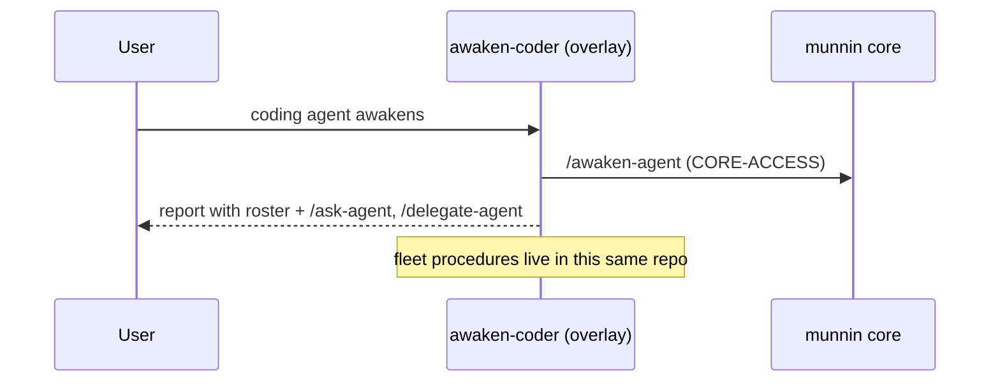
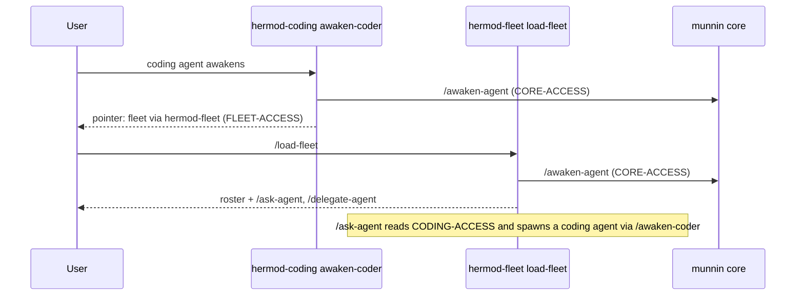

# High Wizard Plan

## **PROJECT INFO**
- **Project**: agent-memory
- **Date**: 2026-10-08
- **Agent**: meta
- **Theme**: Detach the agent-fleet capability into a standalone `agent-memory-fleet` repo — without breaking the overlay, the installer/compile pipeline, or `awaken-coder`
- **Source Protocol**: `/high-wizard` — /high-wizard

*CRITICAL INSTRUCTION: To continue this plan: load the source protocol above, then inspect which sections below are filled vs unfilled to infer your current step.*

---

## **INHERITED CONTEXT**
*Filled at investigation step 0 with whatever was settled before this plan existed. The two sources are recorded separately and never merged — write "None" under a part that does not apply.*
*These decisions are **not yours to reopen**. If one looks wrong, STOP and surface it to [USER-NAME] — do not silently re-decide it here or in Confirmed Decisions below.*

### From the Parent Plan
- **Parent plan**: None — not a sub-plan
- **Assigned scope**: None
- **Integration contracts**: None
- **Pushed-down open items**: None

### From Pre-Planning Discussion
- **Discussion**: Pre-planning discussion with Alvi, 2026-10-08 (the integration-point check that preceded this wizard)
- **Agreed scope**: Separate the agent-fleet capability into its own repo (`agent-memory-fleet`), and do it so nothing breaks — explicitly including the coding overlay and `awaken-coder`.

| # | Settled decision | Chosen | His reason | Status |
|---|------------------|--------|------------|--------|
| 1 | New repo name | `agent-memory-fleet` | He named it: *"separate the agent-fleet into different repo (agent-memory-fleet)"* | Settled |
| 2 | Safety bar | Detachment must not break the overlay or `awaken-coder` | *"I want to make sure this detachment doesn't break anything. including the @agent-coding-awaken-coder"* | Settled |

- **Considered and rejected**: None yet — the discussion produced findings, not rejected alternatives.
- **Left open**: every decision the rounds below present (contents of the new repo, whether it is created now, how `awaken-coder` behaves after the split, tooling strategy, cleanup model, git history, target platforms, cross-repo periphery).

---

## **OBJECTIVES**
Detach the agent-fleet capability out of the coding overlay into a new standalone public repo, `agent-memory-fleet` (codename `hermod-fleet`), and add the per-layer access declarations the split needs, so that neither the overlay's compile/install pipeline nor `awaken-coder` breaks, and every cross-layer handoff (coding to fleet, fleet to coding) resolves whether the target layer is installed or served.

The fleet's runtime **data** (`fleet-agents.md`, `fleet-map.csv`) stays in the central `@agent-memory` store. Only the **operations** (procedures, scripts, templates, installer, access declaration) move.

### **Related Documents**
- `shared-memory/agent-memory/context/mcp-boundary-strategy.md` (store) - the core/overlay boundary this extends into a Hermod family
- overlay `plans/completed/2026-08-07-agent-memory-ops-to-hermod-boundary.md` - the "move the operations, leave the data" precedent
- `shared-memory/agent-memory/context/memory-core-access-and-serving.md` (store) - the `[CORE-ACCESS]` declaration this generalizes to three layers
- [MIGRATION.md](../MIGRATION.md) - the overlay's own extraction note, the pattern the fleet repo mirrors

### **SUCCESS CRITERIA**
- [ ] `agent-memory-fleet` is created (public, Apache-2.0), compiles clean under `--strict`, and installs its four procedures (`setup-fleet`, `load-fleet`, `ask-agent`, `delegate-agent`) as skills/commands on all four harnesses, with green CI.
- [ ] The overlay no longer contains the fleet files and references the fleet exactly once: the `hermod-fleet` pointer in `awaken-coder`.
- [ ] `[CODING-ACCESS]`/`[CODING-MCP-URL]` and `[FLEET-ACCESS]`/`[FLEET-MCP-URL]` are declared and stamped per harness; the `awaken-coder` pointer and the fleet's awaken prompt resolve through them.
- [ ] The installers protect all three manifests (no cross-repo deletion on reinstall).
- [ ] Cross-repo periphery updated: core `check-core-invariant.sh` list + `ARCHITECTURE.md`/`README.md`, the store's `mcp-boundary-strategy.md` + `context-index.md` + `orientation-map.md`, and the overlay's `README.md`/`MIGRATION.md`/`NOTICE`/`pyproject.toml`.
- [ ] All repos' test suites green; no unresolved references.

---

## **SCOPE**

### In Scope
- **Phase 0: access declarations.** Add `[CODING-ACCESS]`/`[CODING-MCP-URL]` (coding layer) and `[FLEET-ACCESS]`/`[FLEET-MCP-URL]` (fleet layer), stamped per harness, coding first. Model: the caller reads the target layer's declaration.
- **New repo `agent-memory-fleet`.** Tooling (copied and adapted from the overlay), the three moved procedures plus the new `load-fleet`, `fleet-scripts/`, the two templates, and README/NOTICE/LICENSE/MIGRATION. Public, Apache-2.0.
- **Overlay cleanup.** Remove the 12 fleet files; replace the roster read and command surfacing with the single `hermod-fleet` pointer in `awaken-coder`; update the overlay's own docs.
- **Fleet scripts.** `build_awaken_prompt` reads CODING-ACCESS and instructs `/awaken-coder`; the `fleet-common.sh:47` dead path is fixed; script/template refs repoint to `[path-to-agent-memory-fleet]`.
- **Installers.** Generalize cleanup to a list of sibling manifests; add per-platform fleet installers; register the fleet placeholder.
- **Cross-repo periphery.** Core repo (`check-core-invariant.sh` ADDON list, `ARCHITECTURE.md`, `README.md`), the memory context (`mcp-boundary-strategy.md`, `context-index.md`, `orientation-map.md`), and the overlay docs.

### Out of Scope
- **Building MCP servers for the coding or fleet layers.** This plan adds the declarations only; serving them is a separate future project (the overlay's stated target delivery).
- **Moving the central fleet data.** `fleet-agents.md` and `fleet-map.csv` stay in the store, as the 2026-08-07 boundary decision established.
- **History-preserving extraction.** The new repo starts fresh with a `MIGRATION.md`.
- **Any change to the core's runtime behavior** beyond the periphery docs and the guard's list.

---

## **CONFIRMED DECISIONS**
*Decisions made **by this plan** — both **asked-and-confirmed** by [USER-NAME] AND **written-through** (Zone A and B decisions made by the agent, recorded with their reasoning). The reasons serve as the analysis record.*
*Decisions settled before this plan existed — by a parent, or in a pre-planning discussion — belong in [INHERITED CONTEXT](#inherited-context) above, not here. Keeping them separate is what shows which decisions this plan actually owns.*

| # | Decision | Chosen | Reason |
|---|----------|--------|--------|
| 1 | Deliverable shape | Create the repo and move now | Well-scoped, and the integration check already produced the edit list; the only prerequisite (a GitHub remote) is an ordinary step. |
| 2 | New repo contents | Capability plus standalone essentials | The fleet has no ADRs of its own; its boundary is recorded where the framework keeps such records. |
| 3 | Visibility and license | Public, Apache-2.0 | Consistent with the core and overlay; no data or secrets move. |
| 4 | Fleet handling in `awaken-coder` | Move the roster read and surfacing to the fleet repo's `/load-fleet`; keep one pointer naming the capability `hermod-fleet` | Removes the commands coupling while preserving project-specific discovery. |
| 5 | New command name | `/load-fleet` | Matches the `/load-*` family and the naming-honesty rule. |
| 6 | Codenames | `munnin` = core, `hermod-coding` = overlay, `hermod-fleet` = fleet | User's convention; makes Hermod the family with two members. |
| 7 | Access-declaration model | Each layer declares its own access; the caller reads the target layer's declaration | Generalizes `[CORE-ACCESS]`; delivery-agnostic. |
| 8 | Access declarations in scope | Both, coding first, as Phase 0 | Sets the pattern once and the fleet copies it. |
| 9 | Installer cleanup | Generalize to a list of sibling manifests; fleet prefix `agent-fleet-` | Closes the cross-repo deletion hazard. |
| 10 | Tooling strategy | Copy and adapt the overlay's tooling into the fleet repo | Matches "each repo installs itself". |
| 11 | Access stamping owner | Each repo's own installer | Matches how CORE-ACCESS is stamped. |
| 12 | Git history | Fresh repo plus `MIGRATION.md` | Mirrors the overlay's own extraction. |
| 13 | Fleet awaken prompt | Read CODING-ACCESS and instruct `/awaken-coder` | Gives CODING-ACCESS its consumer; spawned coding agents get the full awakening. |
| 14 | Target platforms | All four harnesses | Consistent; the `claude` runtime dependency is documented, not a reason to withhold the commands. |
| 15 | Cross-repo periphery | In this plan, as the final phase | A stale boundary description is part of the "break" to avoid. |
| 16 | Naming (write-through) | Placeholder `[path-to-agent-memory-fleet]` with its own uuid guard; folder prefix `agent-fleet-`; manifests `.agent-memory-fleet-*-manifest` | Distinct from the core and overlay names so nothing collides. |
| 17 | `fleet-common.sh` template path (write-through) | Resolve as `$(dirname "$0")/../templates/fleet-map-template.csv` | The current path points inside the store and does not exist, so the template is unused today. |

---

## **SOLUTION**

### Architecture Overview

Three repos plus the store, in a Hermod family:

- **`munnin`** = the memory core (`agent-memory-system` / `control-files`). Unchanged.
- **`hermod-coding`** = this overlay (`agent-memory-coding-skill`). Loses the fleet.
- **`hermod-fleet`** = the new repo (`agent-memory-fleet`). Gains the fleet operations.
- **The store** (`@agent-memory`) = memory data, including the fleet's `fleet-agents.md` and `fleet-map.csv`. Unchanged.

Each layer declares its own access in the harness's global instructions file, and the **caller reads the target layer's declaration**:

- `[CORE-ACCESS]` / `[CORE-MCP-URL]`: read by coding and fleet when they call the core (exists today).
- `[CODING-ACCESS]` / `[CODING-MCP-URL]`: read by the fleet when it calls coding (new).
- `[FLEET-ACCESS]` / `[FLEET-MCP-URL]`: read by coding when it calls the fleet (new).

The value is `markdown` (the layer is installed as local commands/skills) or `mcp` (the layer is served as procedures over a connected server). A pointer names the capability, and the access value picks the invocation form.

Install order: **core first** (it defines `[AGENT-MEMORY-PATH]` and creates the instructions file), then **coding and fleet in any order**. Each registers its own placeholder and access declaration, and each installer's cleanup protects the other two manifests.

### Component 1: Access declarations (Phase 0)
- **Purpose**: give the coding and fleet layers a delivery declaration so cross-layer handoffs resolve whether the layer is installed or served.
- **Key Files**: `agent-memory-coding-skill/setup-scripts/{install-skills.py,setup-all-claude-code.py}` (coding stamp); `agent-memory-fleet/setup-scripts/*` (fleet stamp); the four harness global instruction files.

### Component 2: The new repo `agent-memory-fleet`
- **Purpose**: own the fleet operations as a standalone peer.
- **Key Files**: `procedures/{setup-fleet,load-fleet,ask-agent,delegate-agent}.md`; `fleet-scripts/{ask-agent,delegate-agent,wrap-up-agent,fleet-common}.sh`; `templates/{fleet-agents-template.md,fleet-map-template.csv}`; `setup-scripts/` (copied and adapted); README, NOTICE, LICENSE, MIGRATION.md, `pyproject.toml`, `.github/workflows/ci.yml`.

### Component 3: Fleet capability relocation
- **Purpose**: move the fleet into the new repo and repoint every reference.
- **Key Files**: the moved procedures/scripts/templates above; `fleet-common.sh:47` (template path fix); `build_awaken_prompt` (read CODING-ACCESS, emit `/awaken-coder`); the new `load-fleet.md`.

### Component 4: Overlay cleanup
- **Purpose**: remove the fleet from this repo and leave a single delivery-agnostic pointer.
- **Key Files**: `procedures/awaken-coder.md` (pointer); delete `procedures/{setup-fleet,ask-agent,delegate-agent}.md`, `fleet-scripts/`, `templates/{fleet-agents-template.md,fleet-map-template.csv}`; `README.md`, `MIGRATION.md`, `NOTICE`, `pyproject.toml`.

### Component 5: Installer hardening
- **Purpose**: make cleanup protect every sibling manifest so no installer deletes another repo's commands.
- **Key Files**: `install-skills.py::cleanup`, `setup-all-claude-code.py::_cleanup` (and the fleet copies); per-platform fleet installers; placeholder registration.

### Component 6: Cross-repo periphery
- **Purpose**: keep every description of the boundary true after the split.
- **Key Files**: core `control-files/scripts/check-core-invariant.sh`, `control-files/ARCHITECTURE.md`, `control-files/README.md`; store `shared-memory/agent-memory/context/{mcp-boundary-strategy.md,context-index.md,orientation-map.md}`.

<!-- OPTIONAL SECTION A: multi-system changes, multiple components interacting -->
### Integration Architecture

| Component | Integrates With | Data Flow | Dependencies |
|-----------|----------------|-----------|--------------|
| Access declarations | every layer + the installers | installer writes `[X-ACCESS]` into the harness instruction file; a caller reads it to resolve a handoff | per-harness global instructions file |
| `agent-memory-fleet` | core, the overlay pointer, the store | owns the fleet procedures/scripts; reads the store's roster data and the core's `[AGENT-MEMORY-PATH]` | core (for `[AGENT-MEMORY-PATH]` and `/awaken-agent`), CODING-ACCESS |
| Overlay (`hermod-coding`) | core, fleet | loses the fleet; `awaken-coder` reads FLEET-ACCESS and points at the capability | core, FLEET-ACCESS |
| Installer hardening | all three installers | each cleanup reads all sibling manifests before deleting | the three manifest files |
| Cross-repo periphery | core repo, store, overlay docs | edits only, no runtime path | none |

<!-- OPTIONAL SECTION A2: a change alters a contract that CROSSES a boundary -->
### Cross-System Contract Impact (Blast-Radius Check)

The changed contract is the **harness global instruction file** (its declaration keys), read by four harnesses and by all three installers.

**Change classification**: new/removed field (two new declaration keys: `[CODING-ACCESS]`/`[CODING-MCP-URL]` and `[FLEET-ACCESS]`/`[FLEET-MCP-URL]`)

| # | Consumer (system + path) | How it couples | Breaks how on this change? | Verified / mitigated |
|---|---|---|---|---|
| 1 | Coding overlay installers (`install-skills.py`, `setup-all-claude-code.py`) | append the key if absent, uuid-guarded | none: an added key is additive; the uuid guard prevents duplication | temp-dir test that a re-run does not duplicate the line |
| 2 | Fleet installers (new) | append the key if absent, uuid-guarded | none | same test in the fleet repo |
| 3 | Agent reading handoffs (`awaken-coder`, `build_awaken_prompt`) | reads `[FLEET-ACCESS]` / `[CODING-ACCESS]` | silent-wrong if the key is absent: the agent falls back to the installed-command form | the access rule states the default (markdown) when a key is missing |
| 4 | Core compiled-memory writers (`write-to-*.sh`) | rewrite the file's memory block | none: the new keys sit outside the rewritten block | run the core installer, confirm the keys survive |

- **Deploy ordering**: the installer that owns a key must run before anything reads it; the coding key before the fleet reads it, the fleet key before `awaken-coder` reads it.
- **Existing data**: existing instruction files have no coding/fleet keys; readers must treat "absent" as the default (`markdown`), not as an error.
- **Project registry**: none.

<!-- OPTIONAL SECTION B: changing data/process flow -->
### System Flow Diagrams

**Current State:**

**End Result:**

<!-- OPTIONAL SECTION C: significant technical constraints -->
### Technical Considerations

- **The cleanup hazard is the one real risk**: an overlay reinstall reads its old manifest (which still lists the fleet) and deletes any name not in the one sibling it knows. Generalizing cleanup to a list of sibling manifests is what makes the move safe. Verify by planting a fleet-named command in a temp dir and confirming a coding reinstall leaves it.
- **Per-harness stamping and uuid guards**: each declaration is written by the owning repo's installer, guarded by its own uuid, and must be idempotent across re-runs.
- **The `claude` runtime dependency**: the fleet scripts shell out to the `claude` CLI, so on a harness without it the commands install but a spawn fails. This is documented, not prevented.
- **The discovery tradeoff**: the roster is no longer auto-loaded at awakening; project-specific discovery now rides the `hermod-fleet` pointer plus the roster-existence check, and the fleet's own skill descriptions.
- **Data stays central**: `fleet-agents.md` and `fleet-map.csv` are untouched; only operations move.
- **Compile strictness**: the overlay and fleet each compile under `--strict`. The fleet's one `.md` template (`fleet-agents-template.md`) must move with `setup-fleet`, and `fleet-map-template.csv` is `.csv`, so the compiler never resolves it (it is a runtime copy).

<!-- OPTIONAL SECTION G: produces an ADR -->
### ADR Output
*Created per this plan using the [ADR Template]([path-to-agent-memory-coding-skill]/templates/adr-template.md).*

- **ADR File**: [docs/adr/2026-10-08-hermod-family-and-layer-access.md](../docs/adr/2026-10-08-hermod-family-and-layer-access.md)
- **Decision Summary**: The Hermod overlay splits into a family (`hermod-coding` + `hermod-fleet`), and cross-layer handoffs resolve through a per-layer access declaration that the caller reads.

---

## **IMPLEMENTATION PHASES**

### Phase 1: Scaffold `agent-memory-fleet`
- [ ] **Step 1.1**: Create the repo and its tree
  - **Action**: Create the public GitHub repo `agent-memory-fleet` and the local tree: `procedures/`, `fleet-scripts/`, `templates/`, `setup-scripts/`, `docs/adr/`, `README.md`, `NOTICE`, `LICENSE`, `MIGRATION.md`, `pyproject.toml`, `.github/workflows/ci.yml`.
  - **Implementation**: Mirror the overlay's layout. Apache-2.0 LICENSE and a NOTICE naming the family. `MIGRATION.md` states the fleet came from `agent-memory-coding-skill`.
  - **Testing**: `git status` clean after the first commit; repo visible at the remote.
  - **Success Criteria**: Empty-but-real repo, installable structure in place.

- [ ] **Step 1.2**: Copy and adapt the tooling
  - **Action**: Copy `compile-procedures.py`, `install-skills.py`, `setup-all-claude-code.py`, `setup-all-{codex,antigravity,opencode}.py` and the `.bat` wrappers; change `FOLDER_PREFIX` to `agent-fleet-`, the placeholder to `[path-to-agent-memory-fleet]`, the manifest names to `.agent-memory-fleet-*-manifest`, and the path-definition uuid to a new one.
  - **Implementation**: Keep the compiler generic; no components exist in the fleet repo, so the component path stays inert. Keep template resolution and `--strict`.
  - **Testing**: `compile-procedures.py --strict` runs; installer tests pass in a temp dir.
  - **Success Criteria**: Tooling adapted, tests green on an empty procedure set.

### Phase 2: Access declarations (coding first)
- [ ] **Step 2.1**: Stamp `[CODING-ACCESS]` / `[CODING-MCP-URL]` from the overlay
  - **Action**: Extend the overlay installers to write the coding-layer declaration into each harness instruction file, uuid-guarded and idempotent, values from `CODING_ACCESS` / `CODING_MCP_URL` (default `markdown`).
  - **Implementation**: Mirror `register_env` / `set-core-access.sh`; clamp the value to `markdown` | `mcp`.
  - **Testing**: Re-run the installer twice; assert the line appears once and the uuid is not duplicated.
  - **Success Criteria**: Coding declaration present per harness, idempotent.

- [ ] **Step 2.2**: Stamp `[FLEET-ACCESS]` / `[FLEET-MCP-URL]` from the fleet
  - **Action**: Same in the fleet repo's installers, values from `FLEET_ACCESS` / `FLEET_MCP_URL`.
  - **Implementation**: Same pattern, new uuid.
  - **Testing**: Same idempotency test in the fleet repo.
  - **Success Criteria**: Fleet declaration present per harness, idempotent.

- [ ] **Step 2.3**: Publish the reader rule
  - **Action**: State the rule where handoffs are read: a caller reads the target layer's declaration; `absent` means `markdown`.
  - **Implementation**: Add a `## Layer access` section to `awaken-coder.md`; the fleet's `load-fleet`/`ask-agent` state the same for CODING-ACCESS and CORE-ACCESS.
  - **Testing**: Trace each handoff and confirm it names the declaration it reads.
  - **Success Criteria**: Every cross-layer handoff names its access declaration.

### Phase 3: Harden the installers (before the move)
- [ ] **Step 3.1**: Generalize cleanup to a list of sibling manifests
  - **Action**: Change `cleanup` in `install-skills.py` and `_cleanup` in `setup-all-claude-code.py` to accept a list of sibling manifests (core + coding + fleet) and never delete a name any of them claims.
  - **Implementation**: Replace the single `sibling_manifest` parameter with a list; read each if present.
  - **Testing**: Extend the existing temp-dir tests: a name claimed by any sibling survives, an unclaimed stale name is removed.
  - **Success Criteria**: No installer deletes another repo's command.

- [ ] **Step 3.2**: Apply the same in the fleet copies
  - **Action**: Carry the list-based cleanup into the fleet repo's installers.
  - **Implementation**: Same change; the fleet's siblings are core + coding.
  - **Testing**: Same tests in the fleet repo.
  - **Success Criteria**: All three installers protect all three manifests.

### Phase 4: Relocate the fleet capability
- [ ] **Step 4.1**: Move the procedures and author `load-fleet`
  - **Action**: Move `setup-fleet`, `ask-agent`, `delegate-agent` into `agent-memory-fleet/procedures/`; author `load-fleet.md` (read the roster; surface `/ask-agent`, `/delegate-agent`, `/setup-fleet`).
  - **Implementation**: `load-fleet` reads `[AGENT-MEMORY-PATH]/shared-memory/[project]/fleet-agents.md` (silent skip if missing) and reports the roster plus the available commands.
  - **Testing**: Compile `--strict`; read-through that `load-fleet` covers the roster and the surfacing the overlay's Step 4/6 used to do.
  - **Success Criteria**: Four procedures present and compiling.

- [ ] **Step 4.2**: Move the scripts and templates; repoint references
  - **Action**: Move `fleet-scripts/*` and `templates/{fleet-agents-template.md,fleet-map-template.csv}` into the fleet repo; repoint `[path-to-agent-memory-coding-skill]/fleet-scripts/...` and template refs to `[path-to-agent-memory-fleet]/...`.
  - **Implementation**: Keep `fleet-common.sh` sourced via `$(dirname "$0")`.
  - **Testing**: `grep` shows no `agent-memory-coding-skill` path remains in the fleet repo; `--strict` clean.
  - **Success Criteria**: All references resolve within the fleet repo.

- [ ] **Step 4.3**: Fix the dead template path
  - **Action**: `fleet-common.sh:47` resolves the fleet-map template as `$(dirname "$0")/../templates/fleet-map-template.csv`.
  - **Implementation**: Replace the `${AGENT_MEMORY_PATH}/agent-memory-coding-skill/templates/...` constant.
  - **Testing**: Delete a temp fleet-map.csv and confirm the template is copied, not the inline fallback.
  - **Success Criteria**: The template is used when present.

- [ ] **Step 4.4**: Switch the awaken prompt to read CODING-ACCESS
  - **Action**: `build_awaken_prompt` reads CODING-ACCESS and instructs `/awaken-coder` (installed command or served prompt); the fleet now expects the coding overlay.
  - **Implementation**: Read `[CODING-ACCESS]`; `markdown` emits the command, `mcp` emits the served-procedure instruction, mirroring how `awaken-coder` resolves core handoffs.
  - **Testing**: With CODING-ACCESS `markdown`, the emitted prompt names `/awaken-coder`.
  - **Success Criteria**: A spawned agent receives the full coding awakening instruction.

- [ ] **Step 4.5**: Install the fleet repo
  - **Action**: Compile and install the fleet repo; run its suite.
  - **Implementation**: Run each platform installer; confirm the four commands/skills land under the `agent-fleet-` prefix and the placeholder is registered.
  - **Testing**: Fleet repo CI green; commands resolve.
  - **Success Criteria**: The fleet operates from its own repo.

### Phase 5: Overlay cleanup and reinstall
- [ ] **Step 5.1**: Remove the fleet files from the overlay
  - **Action**: Delete `procedures/{setup-fleet,ask-agent,delegate-agent}.md`, `fleet-scripts/`, and `templates/{fleet-agents-template.md,fleet-map-template.csv}`.
  - **Implementation**: `git rm`; nothing references them except the not-yet-edited `awaken-coder`.
  - **Testing**: `--strict` still resolves (the fleet template is gone, so its reference must be gone too).
  - **Success Criteria**: Overlay tree is fleet-free except the pointer.

- [ ] **Step 5.2**: Replace `awaken-coder`'s fleet step with the pointer
  - **Action**: Remove the roster read (Step 4) and the fleet report (Step 6); add one pointer: "this project has a fleet; fleet operation is available using `hermod-fleet`", resolved via FLEET-ACCESS.
  - **Implementation**: The pointer fires only when `fleet-agents.md` exists, so discovery stays project-specific; it names the capability, not `/load-fleet`.
  - **Testing**: `grep fleet procedures/awaken-coder.md` shows only the pointer; a project with no roster shows nothing.
  - **Success Criteria**: `awaken-coder` behavior is preserved through the pointer.

- [ ] **Step 5.3**: Update the overlay docs
  - **Action**: Remove the fleet capability line and file-tree entries from `README.md`, adjust `MIGRATION.md`, `NOTICE`, `pyproject.toml` description.
  - **Testing**: `grep -i fleet` in the overlay docs reflects the pointer only.
  - **Success Criteria**: Overlay docs describe fleet as a sibling capability.

- [ ] **Step 5.4**: Reinstall the overlay and prove no cross-deletion
  - **Action**: Recompile and reinstall the overlay; confirm the fleet's installed commands survive the overlay's stale-manifest cleanup.
  - **Implementation**: With the list-based cleanup in place, the overlay's old manifest listing the fleet names must skip them.
  - **Testing**: Plant a fleet-named command in the target dir, reinstall the overlay, assert it survives.
  - **Success Criteria**: The hazard is closed in practice.

- [ ] **Step 5.5**: Run the overlay suite
  - **Action**: `uv run pytest` and `ruff` in the overlay.
  - **Testing**: Green; the `_KNOWN` sets never named the fleet, so nothing breaks.
  - **Success Criteria**: Overlay CI green.

### Phase 6: Cross-repo periphery and verification
- [ ] **Step 6.1**: Update the core repo
  - **Action**: Adjust `check-core-invariant.sh`'s ADDON list as needed and correct `ARCHITECTURE.md` and `README.md` so fleet is a third repo, not an overlay capability.
  - **Implementation**: Own commit in `agent-memory-system`.
  - **Testing**: `check-core-invariant.sh` exits 0; no core file names a furniture command as its own.
  - **Success Criteria**: The core describes the family correctly and its guard is green.

- [ ] **Step 6.2**: Update the memory context
  - **Action**: Update `mcp-boundary-strategy.md`, `context-index.md`, and `orientation-map.md` in the store to the family boundary; add the fleet repo as an orientation-map entry.
  - **Implementation**: Follow the store's context conventions.
  - **Testing**: Read-through: the boundary record matches the three repos.
  - **Success Criteria**: The store describes the family correctly.

- [ ] **Step 6.3**: End-to-end verification
  - **Action**: Awaken a coding agent in a project with a roster; confirm the `hermod-fleet` pointer, `/load-fleet`, and `/ask-agent` (spawn reading CODING-ACCESS).
  - **Implementation**: Manual pass across the handoffs.
  - **Testing**: All three handoffs resolve; data untouched.
  - **Success Criteria**: Success criteria in Objectives all hold.

---

## **EXECUTION LOG**
**Execution Protocol for AI**:
I have to use this document as my **ONLY** source of truth to execute and track the plan steps iteratively. I should **NOT** use additional tools like ToDos because it lacks the context of what should I do. Everytime I want to implement a step I have to check the reference to the original step plan above. Everytime a step has been finished I need to go back to this document to log what was done.
*In other words*:
- I have to make this document as the source of truth for the implementation phase on what I have worked on and what I will be working
- The original plan must be fully in my context, therefore, I have to make sure I loaded the **Plan File** before executing any task and read carefully the reference to the original step
- I have to do the implementation by doing it in order per step THEN, I ALWAYS have to fill the step log rightly after

**Definition of Done (applies to ALL steps)**:
- ✅ **Code Quality**: Code compiles/runs without errors
- ✅ **Testing**: Tests written and passing
- ✅ **Logged**: Implementation and testing logged below
- 🚫 **Blocked**: Get input from [USER-NAME] before assuming

### Phase 1: Scaffold `agent-memory-fleet`
- [x] **Step 1.1**: Create the repo and its tree
  - **Implementation Log**: Created `C:\Work\IM\agent-memory-fleet` with the sibling layout (`procedures/`, `fleet-scripts/`, `templates/`, `setup-scripts/`, `docs/adr/`); copied `LICENSE` (Apache-2.0) from the overlay; wrote `README.md`, `NOTICE`, `MIGRATION.md`, `pyproject.toml`, `.gitignore`, `.gitattributes`, `.github/workflows/ci.yml`; `git init -b main` + first commit (8 files). Created the public remote `alvseek/agent-memory-fleet` (empty) and set `origin`.
  - **Testing Log**: `git status -sb` clean after the commit; `gh repo create` returned the repo URL.
  - **Success Criteria**: Pass.
  - **Tech Debts**: First push deferred to Step 1.2 so CI runs green (no tooling/tests in the tree yet). Empty dirs (`procedures/`, `fleet-scripts/`, `templates/`, `docs/adr/`) are populated in later steps.
  - **Result**: Repo and tree in place.
- [x] **Step 1.2**: Copy and adapt the tooling
  - **Implementation Log**: Copied the 8 setup-scripts and 4 tests into the fleet repo. Adapted: `FOLDER_PREFIX` `agent-coding-` → `agent-fleet-`, the placeholder → `[path-to-agent-memory-fleet]`, the manifests → `.agent-memory-fleet-*-manifest`, a fresh path-def uuid (`34ca859f-...`) and env uuid (`669d7723-...`), and every repo-name string. Made the copied tests tolerate the scaffold state (`_KNOWN = set()`; dropped the non-empty assertions) to be populated in Phase 4. Fixed a pre-existing ruff E501 (a 104-char line in `register_env`); the same line also makes the **overlay's** CI red on `main` (run `37726137846` failed) and is fixed when the overlay installer is edited in Phase 2. Added `.gitkeep` to the empty dirs, because a git checkout has no `procedures/` and `compile_all` raises without it.
  - **Testing Log**: `uv run ruff check` clean; `uv run pytest -q` 35 passed; `compile-procedures.py --strict` → 0 procedures, clean. Fleet CI runs `37765057150` (fail: untracked `procedures/`) then `37765134846` (success).
  - **Success Criteria**: Pass.
  - **Tech Debts**: `_KNOWN` and the non-empty assertions stay relaxed until Phase 4 adds the procedures; the overlay's pre-existing E501 is fixed in Phase 2.
  - **Result**: Tooling adapted and green.

### Phase 2: Access declarations (coding first)
- [x] **Step 2.1**: Stamp `[CODING-ACCESS]` / `[CODING-MCP-URL]` from the overlay
  - **Implementation Log**: Added `register_layer_access(...)` and `_CODING_ACCESS_UUID` (`45a0bd66-...`) to the overlay's `setup-scripts/install-skills.py`, plus `_register_layer_access(...)` to `setup-all-claude-code.py`; both called from `run()` and `main()`. The stamp writes `[CODING-ACCESS]` / `[CODING-MCP-URL]` from `CODING_ACCESS` / `CODING_MCP_URL` (defaults `markdown` / `<unset>`), uuid-guarded. Also wrapped the pre-existing E501 that had the overlay's CI red on `main`.
  - **Testing Log**: added idempotency tests to `tests/test_install_skills.py` and `tests/test_setup_all_claude_code.py`; `uv run ruff check` clean; `uv run pytest -q` 37 passed; a smoke render shows the two-key block written once.
  - **Success Criteria**: Pass.
  - **Tech Debts**: None.
  - **Result**: The overlay stamps the coding declaration on every harness.
- [x] **Step 2.2**: Stamp `[FLEET-ACCESS]` / `[FLEET-MCP-URL]` from the fleet
  - **Implementation Log**: Added `register_layer_access(...)` and `_FLEET_ACCESS_UUID` (`40ab1e33-...`) to the fleet's `setup-scripts/install-skills.py`, plus `_register_layer_access(...)` to `setup-all-claude-code.py`; called from `run()` and `main()` with layer `FLEET`. Same shape as the coding stamp: env `FLEET_ACCESS` / `FLEET_MCP_URL`, defaults `markdown` / `<unset>`, uuid-guarded.
  - **Testing Log**: added `FLEET` idempotency tests to both fleet test files; `uv run ruff check` clean; `uv run pytest -q` 37 passed; smoke render shows the fleet block written once.
  - **Success Criteria**: Pass.
  - **Tech Debts**: None.
  - **Result**: The fleet stamps its own declaration.
- [x] **Step 2.3**: Publish the reader rule
  - **Implementation Log**: Added a `## Layer access` section to the overlay's `procedures/awaken-coder.md`: the three declarations, the rule that the caller reads the target layer's declaration, `absent` means `markdown`, and naming the capability before resolving the invocation form. `## Core access` is kept and described as the core instance of the same rule. The fleet half (stating the rule in `load-fleet` / `ask-agent`) lands in Phase 4, when those procedures exist.
  - **Testing Log**: `uv run ruff check` clean; `uv run pytest -q` 37 passed; `compile-procedures.py --strict` → 38 procedures; `output/awaken-coder.md` carries the new section and the heading-reference test still resolves `## Core access`.
  - **Success Criteria**: Pass (overlay half; the fleet half is completed in Phase 4).
  - **Tech Debts**: the fleet half of the reader rule.
  - **Result**: The overlay publishes the delivery-agnostic reader rule.

### Phase 3: Harden the installers (before the move)
- [ ] **Step 3.1**: Generalize cleanup to a list of sibling manifests
  - **Implementation Log**: [on completion]
  - **Testing Log**: [on completion]
  - **Success Criteria**: [Pass/Fail]
  - **Tech Debts**: [or "None"]
  - **Result**: [on completion]
- [ ] **Step 3.2**: Apply the same in the fleet copies
  - **Implementation Log**: [on completion]
  - **Testing Log**: [on completion]
  - **Success Criteria**: [Pass/Fail]
  - **Tech Debts**: [or "None"]
  - **Result**: [on completion]

### Phase 4: Relocate the fleet capability
- [ ] **Step 4.1**: Move the procedures and author `load-fleet`
  - **Implementation Log**: [on completion]
  - **Testing Log**: [on completion]
  - **Success Criteria**: [Pass/Fail]
  - **Tech Debts**: [or "None"]
  - **Result**: [on completion]
- [ ] **Step 4.2**: Move the scripts and templates; repoint references
  - **Implementation Log**: [on completion]
  - **Testing Log**: [on completion]
  - **Success Criteria**: [Pass/Fail]
  - **Tech Debts**: [or "None"]
  - **Result**: [on completion]
- [ ] **Step 4.3**: Fix the dead template path
  - **Implementation Log**: [on completion]
  - **Testing Log**: [on completion]
  - **Success Criteria**: [Pass/Fail]
  - **Tech Debts**: [or "None"]
  - **Result**: [on completion]
- [ ] **Step 4.4**: Switch the awaken prompt to read CODING-ACCESS
  - **Implementation Log**: [on completion]
  - **Testing Log**: [on completion]
  - **Success Criteria**: [Pass/Fail]
  - **Tech Debts**: [or "None"]
  - **Result**: [on completion]
- [ ] **Step 4.5**: Install the fleet repo
  - **Implementation Log**: [on completion]
  - **Testing Log**: [on completion]
  - **Success Criteria**: [Pass/Fail]
  - **Tech Debts**: [or "None"]
  - **Result**: [on completion]

### Phase 5: Overlay cleanup and reinstall
- [ ] **Step 5.1**: Remove the fleet files from the overlay
  - **Implementation Log**: [on completion]
  - **Testing Log**: [on completion]
  - **Success Criteria**: [Pass/Fail]
  - **Tech Debts**: [or "None"]
  - **Result**: [on completion]
- [ ] **Step 5.2**: Replace `awaken-coder`'s fleet step with the pointer
  - **Implementation Log**: [on completion]
  - **Testing Log**: [on completion]
  - **Success Criteria**: [Pass/Fail]
  - **Tech Debts**: [or "None"]
  - **Result**: [on completion]
- [ ] **Step 5.3**: Update the overlay docs
  - **Implementation Log**: [on completion]
  - **Testing Log**: [on completion]
  - **Success Criteria**: [Pass/Fail]
  - **Tech Debts**: [or "None"]
  - **Result**: [on completion]
- [ ] **Step 5.4**: Reinstall the overlay and prove no cross-deletion
  - **Implementation Log**: [on completion]
  - **Testing Log**: [on completion]
  - **Success Criteria**: [Pass/Fail]
  - **Tech Debts**: [or "None"]
  - **Result**: [on completion]
- [ ] **Step 5.5**: Run the overlay suite
  - **Implementation Log**: [on completion]
  - **Testing Log**: [on completion]
  - **Success Criteria**: [Pass/Fail]
  - **Tech Debts**: [or "None"]
  - **Result**: [on completion]

### Phase 6: Cross-repo periphery and verification
- [ ] **Step 6.1**: Update the core repo
  - **Implementation Log**: [on completion]
  - **Testing Log**: [on completion]
  - **Success Criteria**: [Pass/Fail]
  - **Tech Debts**: [or "None"]
  - **Result**: [on completion]
- [ ] **Step 6.2**: Update the memory context
  - **Implementation Log**: [on completion]
  - **Testing Log**: [on completion]
  - **Success Criteria**: [Pass/Fail]
  - **Tech Debts**: [or "None"]
  - **Result**: [on completion]
- [ ] **Step 6.3**: End-to-end verification
  - **Implementation Log**: [on completion]
  - **Testing Log**: [on completion]
  - **Success Criteria**: [Pass/Fail]
  - **Tech Debts**: [or "None"]
  - **Result**: [on completion]

---

## **QUALITY REVIEW**
*Filled by procedure Step 16 (delegated to `/analyze-code-quality` in embedded mode) after all execution phases are complete. **Static** review — answers "is the code clean?".*

- **Scope**: [Files reviewed — from Execution Log, reconciled against `git diff --name-only`]
- **Quality Standard**: [quality-standard.md found / not found — dimensions applied]
- **Findings**: [Issues found, or "No findings — implementation meets quality dimensions"]
- **Fixed**: [What was fixed from approved findings, or "N/A"]

---

## **QA HANDOFF**
*Filled by procedure Step 17 after Quality Review is resolved. This plan is **not** runtime-verified — this section records the plan for that verification, which happens in a QA session with the stack up.*

- **Scope**: [Modules touched — mapped from Execution Log scope]
- **QA instrument**: [Set up (map + bench) / NOT SET UP — auto-skipped]
- **Integration coverage**: NONE — no `qa/qa-map.md` and no built bench (this repo has no runtime stack). The cross-boundary checks run as the installer temp-dir tests (Phase 3, 5.4) and the end-to-end manual pass (Phase 6.3); confirm before implementation.
- **Checklist**: [`qa/checklists/{feature}.md`, or "none — skipped, reason"]
- **Coverage split**: [N automated (named tests) / N manual — of which N are UI-bound]
- **Runtime verification**: **NOT DONE.** Next action: [`/run-qa-test --checklist qa/checklists/{feature}.md` once the stack is up | set up the instrument first: `/map-qa-instrument create` → `/build-qa-bench`]

> Do not read a filled checklist as a passed one. This section says a verification *plan* exists, nothing more.

---

## **POST-COMPLETION**
After all phases are executed, logged, and both **Quality Review** + **QA Handoff** are filled, move this plan to `plans/completed/`:
`mkdir -p ./plans/completed && mv ./plans/[this-file].md ./plans/completed/[this-file].md`
