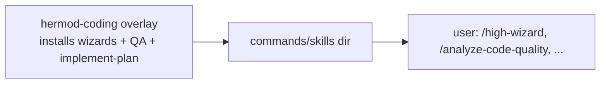
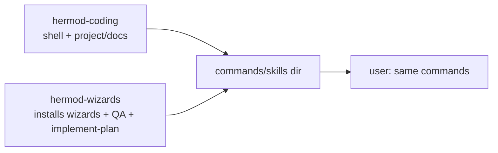

# High Wizard Plan

## **PROJECT INFO**
- **Project**: agent-memory
- **Date**: 2026-10-08
- **Agent**: meta
- **Theme**: Detach the wizard + QA + implement-plan cluster out of the coding overlay into a standalone `agent-memory-wizards` repo (`hermod-wizards`), without breaking the overlay, its installer/compile pipeline, or the doc generators that fall back to the core decision format
- **Source Protocol**: `/high-wizard` — /high-wizard

*CRITICAL INSTRUCTION: To continue this plan: load the source protocol above, then inspect which sections below are filled vs unfilled to infer your current step.*

---

## **INHERITED CONTEXT**
*Filled at investigation step 0 with whatever was settled before this plan existed. The two sources are recorded separately and never merged — write "None" under a part that does not apply.*
*These decisions are **not yours to reopen**. If one looks wrong, STOP and surface it to [USER-NAME] — do not silently re-decide it here or in Confirmed Decisions below.*

### From the Parent Plan
- **Parent plan**: None — not a sub-plan
- **Assigned scope**: None
- **Integration contracts**: None
- **Pushed-down open items**: None

### From Pre-Planning Discussion
- **Discussion**: Pre-planning discussion with Alvi, 2026-10-08/09 (this session, right after the fleet extraction closed). The discussion began as "localization next", then narrowed to the wizard cluster.
- **Agreed scope**: extract the **wizard + QA + implement-plan cluster** out of the coding overlay into a standalone peer repo, and leave everything else (project context, orientation map, doc generation, localization, the shell) in `agent-memory-coding-skill`.

| # | Settled decision | Chosen | His reason | Status |
|---|------------------|--------|------------|--------|
| 1 | Which capability is next | The wizard cluster (not localization) | After walking the 2-way/3-way overlay splits he chose "just do hermod-wizards now, leave the other in current agent-memory-coding-skill" | Settled |
| 2 | Scope of this plan | `hermod-wizards` only; project + localization deferred to a later plan | "let's just focus on moving the hermod-wizards for now" | Settled |
| 3 | Repo name + codename | `agent-memory-wizards` / `hermod-wizards` (plural) | "let's name the repo agent-memory-wizards. we'll mention it as hermod-wizards"; plural chosen over singular | Settled |
| 4 | `wait-options-coding` | Moves with the cluster | "move it" | Settled |
| 5 | The three doc generators | Repoint their ambiguous-scope branch from `/wait-options-coding` to the core `/wait-options` | "we'll let those 3 generate procedures to fallback to /wait-options. after all, I seldomly used it" | Settled |
| 6 | Cluster membership | wizards x6 + `implement-plan` + all QA + `wait-options-coding` + wizard/QA components + templates | "what if we include implement-plan + all QA procedures?" and confirmed | Settled |

- **Considered and rejected**: extract localization / `hermod-project` now → deferred (this plan is wizards-only); omit the wizards *without* `implement-plan` + QA → lost (orphans `implement-plan` and QA's only caller); keep `wait-options-coding` in the overlay → lost (he chose to move it and fall back to core); singular codename `hermod-wizard` → lost (plural reads as a collection).
- **Left open**: whether the wizards layer declares its own access declaration (no cross-layer caller exists yet); whether `generate-standard` (QA-listed but a doc generator) travels with the cluster; the `[path-to-agent-memory-wizards]` placeholder + folder/manifest prefixes; tooling strategy; git history; target platforms; cross-repo periphery.

---

## **OBJECTIVES**
Detach the **wizard + QA + implement-plan cluster** out of the coding overlay into a new standalone public repo, `agent-memory-wizards` (codename `hermod-wizards`), so the wizards become an independent leaf layer that reads only the memory core, and the overlay keeps the project / doc / localization surface. Nothing calls the wizards layer, so it declares no access. The overlay stops installing and removing the cluster, and the new repo installs itself (OpenCode only, for now).

### **Related Documents**
- [2026-10-08-agent-memory-fleet-extraction.md](completed/2026-10-08-agent-memory-fleet-extraction.md) - the extraction this mirrors (repo, tooling, periphery, ADR)
- [MIGRATION.md](../MIGRATION.md) - the overlay's own extraction note, the pattern the new repo mirrors
- [../docs/adr/2026-10-08-hermod-family-and-layer-access.md](../docs/adr/2026-10-08-hermod-family-and-layer-access.md) - the family + layer-access model this extends
- `shared-memory/agent-memory/context/mcp-boundary-strategy.md` (store) - the boundary principle

### **SUCCESS CRITERIA**
- [ ] `agent-memory-wizards` exists (public, Apache-2.0), compiles clean, and installs the cluster as OpenCode skills with green CI.
- [ ] The overlay no longer installs or removes the cluster, and its installer protects the wizards manifest.
- [ ] The three doc generators fall back to the core `/wait-options`; no overlay procedure references `wait-options-coding`.
- [ ] Cross-repo periphery updated: core `ARCHITECTURE.md`/`README.md`/`SETUP.md`, store context + orientation map, overlay `README.md`/`MIGRATION.md`/`NOTICE`/`pyproject.toml`/tests, and one ADR.
- [ ] All repos' test suites green; no unresolved references.

---

## **SCOPE**

### In Scope
- **New repo `agent-memory-wizards`**: tooling copied and adapted from the overlay (OpenCode-only installer, its own manifest, compile scripts, CI), the moved procedures/components/templates, and README / NOTICE / LICENSE / MIGRATION / `pyproject.toml`.
- **Moved set**: wizards x6, `implement-plan`, QA x9, `wait-options-coding`; components `archive-plan`, `build-riao-mechanisms`, `plan-final-review`, `plan-self-review`, `planning-decision`, `planning-investigation`, `planning-rounds`, `subplan-handoff-read`, `subplan-handoff-write`; templates `adr-template`, `qa-readme-template`, `quality-standard-template`; the whole `plan-templates/` folder.
- **Overlay cleanup**: remove the cluster files; drop them from the install set; add the wizards manifest to the sibling-manifest protection; drop the wizard fixtures from the overlay tests; add `.gitkeep` to the emptied `plan-templates/`.
- **Doc-generator fallback**: `generate-architecture-docs`, `generate-domain-docs`, `generate-flow-docs` repoint their ambiguous-scope branch to the core `/wait-options`.
- **Cross-repo periphery**: core docs, store context + orientation map, overlay docs, one ADR.

### Out of Scope
- **The project / localization split** — deferred to a later plan; everything else stays in `agent-memory-coding-skill`.
- **Claude Code / Codex / Antigravity installers for the wizards repo** — OpenCode only for now; the other three harnesses lose the wizard commands until added.
- **A `[WIZARDS-ACCESS]` declaration** — no caller exists.
- **Moving the store's wizard context data** — memory stays central.
- **History-preserving extraction** — the new repo starts fresh with a `MIGRATION.md`.
- **Any change to the core's runtime behavior.**

---

## **CONFIRMED DECISIONS**
*Decisions made **by this plan** — both **asked-and-confirmed** by [USER-NAME] AND **written-through** (Zone A and B decisions made by the agent, recorded with their reasoning). The reasons serve as the analysis record.*
*Decisions settled before this plan existed — by a parent, or in a pre-planning discussion — belong in [INHERITED CONTEXT](#inherited-context) above, not here. Keeping them separate is what shows which decisions this plan actually owns.*

| # | Decision | Chosen | Reason |
|---|----------|--------|--------|
| 1 | Deliverable shape | Create the repo and move now | Well-scoped; the integration check produced the exact file set. |
| 2 | Repo contents | Cluster plus standalone essentials | The wizards have no ADRs of their own; the boundary is recorded in the overlay. |
| 3 | Visibility and license | Public, Apache-2.0 | Consistent with the core, overlay, and fleet; no data or secrets move. |
| 4 | Access declaration | **None** | No caller: the cluster reads only the core and nothing invokes it. A declaration with no reader is dead config. |
| 5 | `generate-standard` | Moves with the cluster | Its template (`code-quality-analysis-template`) and its consumer (`analyze-code-quality`) are in the cluster; leaving it would create an overlay to wizards dependency. |
| 6 | `wait-options-coding` | Moves; the 3 doc generators fall back to core `/wait-options` | User's call; the branch is rarely hit and degrades to the base format. |
| 7 | Overlay installer | Drops the cluster from its install set and protects the wizards manifest | The overlay must no longer install or remove the cluster's commands. |
| 8 | Wizards installer scope | OpenCode only | User's call ("opencode only is fine for now"). |
| 9 | Tooling strategy | Copy and adapt the overlay's OpenCode tooling into the new repo | Matches "each repo installs itself". |
| 10 | Git history | Fresh repo plus `MIGRATION.md` | Mirrors the overlay's and the fleet's extraction. |
| 11 | Naming (write-through) | Placeholder `[path-to-agent-memory-wizards]` with its own uuid guard; folder prefix `agent-wizards-`; manifests `.agent-memory-wizards-*-manifest`; codename `hermod-wizards` | Distinct from core, overlay, and fleet names so nothing collides. |
| 12 | Migration | Install the wizards repo; documented in the overlay's `MIGRATION.md`/`SETUP.md` | The sibling-manifest protection needs the wizards manifest present. |
| 13 | Cross-repo periphery | In this plan, as the final phase | A stale boundary description is part of the "break" to avoid. |
| 14 | Core invariant guard | Unchanged | The wizard names stay add-on names regardless of which add-on repo owns them. |

---

## **SOLUTION**

### Architecture Overview

The Hermod family gains a fourth member, and the new one is a leaf.

- **`munnin`** = the memory core (`agent-memory-system` / `control-files`). Unchanged.
- **`hermod-coding`** = this overlay (`agent-memory-coding-skill`). Loses the wizard + QA + implement-plan cluster; keeps the shell (`awaken-coder`, `project-wrap-up`, `dockerize`, push/pull), the project / doc surface (map, project context, doc generators, localization).
- **`hermod-wizards`** = the new repo (`agent-memory-wizards`). Owns the cluster.
- **`hermod-fleet`** = the fleet (`agent-memory-fleet`). Unchanged.
- **The store** (`@agent-memory`) = memory data. Unchanged; the wizard context docs stay central.

Dependency direction: `hermod-wizards` reads **only** the core (its `wait-options-coding` invokes the core `/wait-options` through `[CORE-ACCESS]`). Nothing calls `hermod-wizards`, so it declares no access. `hermod-coding` no longer references the cluster: the only overlay procedures that used `wait-options-coding` (the three doc generators) repoint to the core.

Install: each repo installs itself into the same commands/skills directory, so the user types the same commands. The wizards repo installs on **OpenCode only** for now. The overlay's cleanup protects the wizards manifest, so a reinstall never deletes the cluster's commands.

### Component 1: The new repo `agent-memory-wizards`
- **Purpose**: own the wizard + QA + implement-plan cluster as a standalone leaf.
- **Key Files**: `procedures/{high-wizard,quick-wizard,council-of-wizards,rite-of-creation,forge-of-covenant,pixel-wizard,implement-plan,analyze-code-quality,build-qa-bench,generate-qa-checklist,integration-test,map-qa-instrument,qa-status,run-qa-test,setup-qa-visual-instrument,generate-standard,wait-options-coding}.md`; `components/{archive-plan,build-riao-mechanisms,plan-final-review,plan-self-review,planning-decision,planning-investigation,planning-rounds,subplan-handoff-read,subplan-handoff-write}.md`; `templates/{adr-template,qa-readme-template,quality-standard-template}.md`; `plan-templates/{high-wizard-plan-template,council-of-wizards-plan-template,rite-of-creation-plan-template,forge-of-covenant-plan-template,code-quality-analysis-template}.md`; `setup-scripts/` (OpenCode-only, copied and adapted); `README.md`, `NOTICE`, `LICENSE`, `MIGRATION.md`, `pyproject.toml`, `.github/workflows/ci.yml`.

### Component 2: Capability relocation
- **Purpose**: move the cluster and repoint every internal reference.
- **Key Files**: the moved files above; every `[path-to-agent-memory-coding-skill]` inside them becomes `[path-to-agent-memory-wizards]`.

### Component 3: Overlay cleanup
- **Purpose**: remove the cluster from the overlay and stop the overlay installing or removing it.
- **Key Files**: delete the moved procedures/components/templates + the `plan-templates/` contents; `setup-scripts/install-skills.py` + `setup-scripts/setup-all-opencode.py` (drop the cluster from the install set, add `.agent-memory-wizards-opencode-manifest` to the sibling list); `tests/test_install_skills.py` + `tests/test_setup_all_claude_code.py` (drop the wizard fixtures); `.gitkeep` in the emptied `plan-templates/`.

### Component 4: Doc-generator fallback
- **Purpose**: the three doc generators use the core decision format.
- **Key Files**: `procedures/generate-architecture-docs.md`, `procedures/generate-domain-docs.md`, `procedures/generate-flow-docs.md`.

### Component 5: Cross-repo periphery
- **Purpose**: keep every boundary description true after the split.
- **Key Files**: core `control-files/{ARCHITECTURE.md,README.md,SETUP.md}`; store `shared-memory/agent-memory/context/orientation-map.md` + `agent-meta/knowledge-base/agent-memory/{wizard-architecture.md,wait-options-technical-disclosure.md}`; overlay `README.md`, `MIGRATION.md`, `NOTICE`, `pyproject.toml`; overlay `docs/adr/` (new ADR).

### Integration Architecture

| Component | Integrates With | Data Flow | Dependencies |
|-----------|----------------|-----------|--------------|
| `agent-memory-wizards` | core | procedures invoke core `/wait-options` via `[CORE-ACCESS]` | core |
| Overlay installer | all sibling manifests | cleanup reads core + fleet + wizards manifests before deleting | the manifest files |
| Doc generators | core | ambiguous-scope branch invokes core `/wait-options` | core |
| New-repo tooling | the OpenCode commands/skills dir | installs skills, writes its own manifest | OpenCode |
| Cross-repo periphery | core repo, store, overlay docs | edits only | none |

### Cross-System Contract Impact (Blast-Radius Check)

The changed contract is the **harness install surface**: which manifest owns which command. Producer = the overlay installer (stops claiming the cluster) and the wizards installer (starts claiming it). Consumers = the cleanup logic and the user's installed commands.

**Change classification**: ☑ new/removed field (the command set moves between manifests)

| # | Consumer (system + path) | How it couples | Breaks how on this change? | Verified / mitigated |
|---|---|---|---|---|
| 1 | Overlay cleanup (`install-skills.py`, `setup-all-opencode.py`) | reads its old manifest; deletes what it claims unless a sibling claims it | silent-wrong: could delete the cluster commands if the wizards manifest is absent | add the wizards manifest to the sibling list; install the wizards repo |
| 2 | OpenCode commands/skills dir | the user's installed skills | commands absent during the migration window | install order (wizards repo first) |
| 3 | Overlay tests | assert known commands include `high-wizard` / `quick-wizard` | crash: fixture fails after removal | update the fixtures |
| 4 | Core `check-core-invariant.sh` | lists the wizard names as add-on | none: names unchanged | no change |

- **Deploy ordering**: install the wizards repo (its manifest protects the commands), then the overlay.
- **Existing data**: existing machines have the cluster claimed by the overlay manifest.
- **Project registry**: none.

### System Flow Diagrams

**Current State:**

**End Result:**

### Technical Considerations

- **Compile pipeline**: the overlay's `compile-procedures.py` inlines components and resolves `[path-to-...]` template references; the new repo copies it and gets its own placeholder plus `plan-templates/` and `templates/` dirs.
- **OpenCode-only**: the new repo ships `setup-all-opencode.py` + `install-skills.py` (adapted). The overlay's other-harness installers stop carrying the cluster, so Claude Code / Codex / Antigravity lose the wizard commands until added.
- **Skill size**: `pixel-wizard` compiles to roughly 35k, which is why the OpenCode path installs skills rather than workflow commands. Not a blocker on OpenCode.
- **Emptied `plan-templates/`**: git drops empty directories; add `.gitkeep` (the fleet hit the same for `procedures/`).
- **One-way dependency**: after the doc-generator fallback, no overlay procedure references the cluster, so `hermod-coding` to `hermod-wizards` is zero.
- **Sibling manifests**: the overlay's cleanup already reads a sibling list; add `.agent-memory-wizards-opencode-manifest` so the cluster's commands survive an overlay reinstall.

### ADR Output
*Created by procedure Step 11 using the [ADR Template]([path-to-agent-memory-coding-skill]/templates/adr-template.md).*

- **ADR File**: `docs/adr/2026-10-09-hermod-wizards-extraction.md` (ADR-021, the next number after the family / layer-access ADR-020)
- **Decision Summary**: The wizard + QA + implement-plan cluster is extracted into a standalone leaf repo `hermod-wizards` that declares no access, and the overlay stops installing or removing it.

---

## **IMPLEMENTATION PHASES**

### Phase 1: Scaffold `agent-memory-wizards`
- [x] **Step 1.1**: Create the repo skeleton and essentials
  - **Action**: Create the public repo `agent-memory-wizards` with its directory layout and standalone essentials.
  - **Implementation**: `git init`; create `procedures/`, `components/`, `templates/`, `plan-templates/`, `setup-scripts/`, `tests/`, `.github/workflows/`; write `README.md`, `NOTICE`, `LICENSE` (Apache-2.0), `MIGRATION.md`, `pyproject.toml`.
  - **Testing**: `git status` clean; license + notice present.
  - **Success Criteria**: The repo exists with the expected skeleton.

- [x] **Step 1.2**: Copy and adapt the OpenCode tooling
  - **Action**: Bring the overlay's compile + OpenCode install scripts over, adapted to the new repo.
  - **Implementation**: copy `compile-procedures.py`, `install-skills.py`, `setup-all-opencode.py` (+ `.bat`); register the placeholder `[path-to-agent-memory-wizards]` with its own uuid guard; set the manifest name `.agent-memory-wizards-opencode-manifest` and the skill prefix `agent-wizards-`; keep the template dir names (`plan-templates`, `templates`).
  - **Testing**: run the compiler against an empty set; run the installer into a temp dir.
  - **Success Criteria**: Compile and install run clean with no procedures yet.

- [x] **Step 1.3**: Green CI
  - **Action**: Add the copied tests + workflow.
  - **Implementation**: adapt the overlay's test files (heading references, compile, install, setup) to the new repo; `.github/workflows/ci.yml` runs `pytest` + `ruff`.
  - **Testing**: `pytest` green locally and in CI.
  - **Success Criteria**: CI green on the empty repo.

### Phase 2: Move the cluster
- [x] **Step 2.1**: Copy the 17 procedures
  - **Action**: Bring the wizard + QA + implement-plan procedures and `wait-options-coding` into `procedures/` (cross-repo copy; the overlay originals are deleted in Phase 3).
  - **Implementation**: copy from the overlay: `high-wizard`, `quick-wizard`, `council-of-wizards`, `rite-of-creation`, `forge-of-covenant`, `pixel-wizard`, `implement-plan`, `analyze-code-quality`, `build-qa-bench`, `generate-qa-checklist`, `integration-test`, `map-qa-instrument`, `qa-status`, `run-qa-test`, `setup-qa-visual-instrument`, `generate-standard`, `wait-options-coding`.
  - **Testing**: file count + names match the plan.
  - **Success Criteria**: All 17 present in the new repo.

- [x] **Step 2.2**: Copy the 9 components
  - **Action**: Bring the wizard/QA components across.
  - **Implementation**: copy `archive-plan`, `build-riao-mechanisms`, `plan-final-review`, `plan-self-review`, `planning-decision`, `planning-investigation`, `planning-rounds`, `subplan-handoff-read`, `subplan-handoff-write`. Leave `compute-doc-placement`, `present-doc-for-review`, `push-exclude-policy` in the overlay.
  - **Testing**: the 9 are present in the new repo.
  - **Success Criteria**: Components split as planned.

- [x] **Step 2.3**: Copy the 3 templates + the 5 plan-templates
  - **Action**: Bring the cluster's templates across.
  - **Implementation**: copy `templates/{adr-template,qa-readme-template,quality-standard-template}.md` and all of `plan-templates/*`. Leave the doc-gen templates in the overlay.
  - **Testing**: template lists match.
  - **Success Criteria**: Templates split as planned.

- [x] **Step 2.4**: Repoint the placeholder
  - **Action**: Every reference inside the moved files now points at the new repo.
  - **Implementation**: replace `[path-to-agent-memory-coding-skill]` with `[path-to-agent-memory-wizards]` across the moved procedures/components/templates.
  - **Testing**: `grep` shows zero `path-to-agent-memory-coding-skill` in the new repo.
  - **Success Criteria**: No stale placeholder.

- [x] **Step 2.5**: Compile + install on OpenCode, run the new repo's tests
  - **Action**: Prove the moved cluster is intact.
  - **Implementation**: compile; install into the OpenCode commands/skills dir; run `pytest`.
  - **Testing**: all tests green; the skills appear with the `agent-wizards-` prefix.
  - **Success Criteria**: The cluster compiles, installs, and passes.

### Phase 3: Overlay cleanup
- [x] **Step 3.1**: Delete the moved files
  - **Action**: Remove the cluster from the overlay.
  - **Implementation**: delete the moved procedures/components/templates; empty `plan-templates/` and add a `.gitkeep` so git keeps the dir.
  - **Testing**: the overlay holds none of the moved files; `plan-templates/` still exists.
  - **Success Criteria**: The overlay is cluster-free.

- [x] **Step 3.2**: Update the overlay installer
  - **Action**: The overlay stops installing and removing the cluster.
  - **Implementation**: in `install-skills.py` + `setup-all-opencode.py`, drop the cluster from the install set and add `.agent-memory-wizards-opencode-manifest` to the sibling-manifest list.
  - **Testing**: a reinstall into a temp dir with a pre-existing wizards manifest leaves those commands untouched.
  - **Success Criteria**: The overlay neither installs nor deletes the cluster's commands.

- [x] **Step 3.3**: Update the overlay tests
  - **Action**: Drop the wizard fixtures.
  - **Implementation**: `tests/test_install_skills.py` and `tests/test_setup_all_claude_code.py` no longer assert `high-wizard` / `quick-wizard`.
  - **Testing**: overlay `pytest` green.
  - **Success Criteria**: Overlay suite green without the cluster.

### Phase 4: Doc-generator fallback
- [x] **Step 4.1**: Repoint the three doc generators
  - **Action**: Their ambiguous-scope branch uses the core format.
  - **Implementation**: in `generate-architecture-docs`, `generate-domain-docs`, `generate-flow-docs`, change the `/wait-options-coding` reference to the core `/wait-options`.
  - **Testing**: compile; the three commands carry the core reference.
  - **Success Criteria**: The branch resolves to the core command.

- [x] **Step 4.2**: Reference sweep
  - **Action**: Confirm nothing else in the overlay uses the cluster.
  - **Implementation**: `grep` the overlay for `wait-options-coding` and the cluster procedure names.
  - **Testing**: zero hits outside historical docs/ADRs.
  - **Success Criteria**: No dangling overlay reference.

### Phase 5: Cross-repo periphery + ADR
- [x] **Step 5.1**: Core docs
  - **Action**: The core describes the cluster's new home.
  - **Implementation**: update `control-files/{ARCHITECTURE.md,README.md,SETUP.md}`; the invariant guard list is unchanged (names stay add-on).
  - **Testing**: docs name `hermod-wizards`; guard still passes.
  - **Success Criteria**: Core docs true.

- [x] **Step 5.2**: Store context + orientation map
  - **Action**: The store's context reflects the split.
  - **Implementation**: update `shared-memory/agent-memory/context/orientation-map.md` and `agent-meta/knowledge-base/agent-memory/{wizard-architecture.md,wait-options-technical-disclosure.md}`.
  - **Testing**: entries name the new repo.
  - **Success Criteria**: Store context true.

- [x] **Step 5.3**: Overlay docs
  - **Action**: The overlay describes what it kept and what left.
  - **Implementation**: update `README.md`, `MIGRATION.md` (add a "later move: wizards" section), `NOTICE`, `pyproject.toml`.
  - **Testing**: read-through.
  - **Success Criteria**: Overlay docs true.

- [x] **Step 5.4**: Write ADR-021
  - **Action**: Record the boundary decision.
  - **Implementation**: `docs/adr/2026-10-09-hermod-wizards-extraction.md` from the ADR template; link it to this plan.
  - **Testing**: file present and linked.
  - **Success Criteria**: ADR committed.

- [x] **Step 5.5**: Run every suite + reference sweep
  - **Action**: Prove nothing is broken across the repos.
  - **Implementation**: run the overlay + new repo suites; `grep` for unresolved references.
  - **Testing**: all green; no unresolved reference.
  - **Success Criteria**: Every repo's suite green.

### Phase 6: Live verify on OpenCode
- [x] **Step 6.1**: Install both repos and exercise a command
  - **Action**: Confirm the end state on the real harness.
  - **Implementation**: install the wizards repo, then the overlay; confirm the wizard skills resolve with the `agent-wizards-` prefix and the overlay no longer lists them.
  - **Testing**: invoke one wizard skill; confirm it loads.
  - **Success Criteria**: The cluster works from its new repo; the overlay is clean.

- [x] **Step 6.2**: Confirm manifests coexist
  - **Action**: Prove the sibling protection works.
  - **Implementation**: reinstall the overlay; confirm the wizards commands survive.
  - **Testing**: the wizards manifest + commands still present.
  - **Success Criteria**: No cross-repo deletion.

---

## **EXECUTION LOG**
**Execution Protocol for AI**:
I have to use this document as my **ONLY** source of truth to execute and track the plan steps iteratively. I should **NOT** use additional tools like ToDos because it lacks the context of what should I do. Everytime I want to implement a step I have to check the reference to the original step plan above. Everytime a step has been finished I need to go back to this document to log what was done.
*In other words*:
- I have to make this document as the source of truth for the implementation phase on what I have worked on and what I will be working
- The original plan must be fully in my context, therefore, I have to make sure I loaded the **Plan File** before executing any task and read carefully the reference to the original step
- I have to do the implementation by doing it in order per step THEN, I ALWAYS have to fill the step log rightly after

**Definition of Done (applies to ALL steps)**:
- ✅ **Code Quality**: Code compiles/runs without errors
- ✅ **Testing**: Tests written and passing
- ✅ **Logged**: Implementation and testing logged below
- 🚫 **Blocked**: Get input from [USER-NAME] before assuming

### Phase 1:
- [x] **Step 1.1**: Create the repo skeleton and essentials
  - **Implementation Log**: Created `C:\Work\IM\agent-memory-wizards` with `procedures/`, `components/`, `templates/`, `plan-templates/`, `setup-scripts/`, `tests/`, `.github/workflows/`, `docs/adr/`; `git init`. Copied `LICENSE`, `.gitignore`, `.gitattributes` from the fleet repo. Wrote `README.md`, `NOTICE`, `MIGRATION.md`, `pyproject.toml` (adapted for the wizards cluster; README notes OpenCode-only and no access declaration).
  - **Testing Log**: `git status --short` lists the seven essentials as untracked; `.gitignore` ignores `output/`, `__pycache__/`, `.venv/`, `uv.lock`, `.pytest_cache/`. LICENSE + NOTICE present.
  - **Success Criteria**: Pass — the repo exists with the expected skeleton and essentials.
  - **Tech Debts**: None.
  - **Result**: Skeleton + essentials in place; no remote created yet.

- [x] **Step 1.2**: Copy and adapt the OpenCode tooling
  - **Implementation Log**: Copied `compile-procedures.py`, `install-skills.py`, `setup-all-opencode.py`, `setup-all-opencode.bat` from the fleet (already sibling-adapted). Adapted: `FOLDER_PREFIX = "agent-wizards-"`; new UUIDs for the path def (`ffcd378b-d142-4042-babb-c6c590d6af8b`) and env def (`b4c53fb9-ab52-499e-9fad-e6c8cb12ac12`); removed the `[FLEET-ACCESS]` declaration and `register_layer_access` (decision 4: no access declaration); placeholder `[path-to-agent-memory-wizards]`; manifest `.agent-memory-wizards-opencode-manifest`; sibling list `[core, coding, fleet]`; compiler docstring example repointed.
  - **Testing Log**: `compile-procedures.py --strict --quiet` on the empty set → "Compiled 0 procedures", exit 0. `install()` into a temp dir → `([], 0)`. `FOLDER_PREFIX` == `agent-wizards-`.
  - **Success Criteria**: Pass — the tooling runs clean with no procedures yet.
  - **Tech Debts**: None.
  - **Result**: Tooling in place and verified.

- [x] **Step 1.3**: Green CI
  - **Implementation Log**: Added `tests/test_compile_procedures.py` (placeholder repointed), `tests/test_heading_references.py` (authored dirs widened to procedures/components/plan-templates/templates), a rewritten `tests/test_install_skills.py`, and a new `tests/test_setup_all_opencode.py`. Copied `.github/workflows/ci.yml` (pytest + ruff + `--strict` compile).
  - **Testing Log**: The synthetic/unit tests pass now; the real-tree assertions (non-empty `procedures/`, the `_KNOWN` set) require the cluster to be present, so full-suite green is verified at Step 2.5.
  - **Success Criteria**: Partial — CI is configured; green is verified once Phase 2 lands (deferred to Step 2.5, not a defect).
  - **Tech Debts**: None.
  - **Result**: CI + tests in place; green deferred to 2.5 by construction.

### Phase 2:
- [x] **Step 2.1**: Copy the 17 procedures
  - **Implementation Log**: Copied the 17 procedures from the overlay into `procedures/` (cross-repo copy; overlay originals untouched).
  - **Testing Log**: `procedures/` holds 17 `.md` files matching the plan.
  - **Success Criteria**: Pass.
  - **Tech Debts**: None.
  - **Result**: All 17 present.

- [x] **Step 2.2**: Copy the 9 components
  - **Implementation Log**: Copied the 9 wizard/QA components into `components/`.
  - **Testing Log**: `components/` holds 9 `.md` files.
  - **Success Criteria**: Pass.
  - **Tech Debts**: None.
  - **Result**: Components split as planned.

- [x] **Step 2.3**: Copy the 3 templates + the 5 plan-templates
  - **Implementation Log**: Copied `adr-template`, `qa-readme-template`, `quality-standard-template` into `templates/` and all 5 files into `plan-templates/`. Removed the scaffold `.gitkeep` files now that the dirs are populated.
  - **Testing Log**: `templates/` = 3, `plan-templates/` = 5.
  - **Success Criteria**: Pass.
  - **Tech Debts**: None.
  - **Result**: Templates split as planned.

- [x] **Step 2.4**: Repoint the placeholder
  - **Implementation Log**: Byte-level replace of `[path-to-agent-memory-coding-skill]` → `[path-to-agent-memory-wizards]` across the copied `.md` files: 11 files, 109 occurrences. Byte-level so LF and encoding are preserved.
  - **Testing Log**: `Select-String` finds zero `path-to-agent-memory-coding-skill` in the new repo; 105 lines carry the new placeholder.
  - **Success Criteria**: Pass.
  - **Tech Debts**: None.
  - **Result**: No stale placeholder.

- [x] **Step 2.5**: Compile + install on OpenCode, run the new repo's tests
  - **Implementation Log**: Ran the full toolchain on the moved cluster.
  - **Testing Log**: `compile-procedures.py --strict --quiet` → 17 compiled, exit 0 (no unresolved component/template). `pytest -q` → **33 passed**. `ruff check` → all checks passed. `install()` into a temp dir → 17 skills, 0 removed.
  - **Success Criteria**: Pass — the cluster compiles, installs, and passes.
  - **Tech Debts**: None.
  - **Result**: The new repo is green with the cluster in place.

### Phase 3:
- [x] **Step 3.1**: Delete the moved files
  - **Implementation Log**: Deleted the 17 procedures, 9 components, and 3 templates from the overlay; emptied `plan-templates/` and added `.gitkeep`.
  - **Testing Log**: Overlay now holds 18 procedures, 3 components, 8 templates; `plan-templates/` = `.gitkeep` only.
  - **Success Criteria**: Pass — the overlay is cluster-free.
  - **Tech Debts**: None.
  - **Result**: Cluster removed from the overlay.

- [x] **Step 3.2**: Update the overlay installer
  - **Implementation Log**: Added `WIZARDS_MANIFEST_NAME = ".agent-memory-wizards-opencode-manifest"` to the overlay's `setup-all-opencode.py` and included it in `sibling_manifest_names`. Updated the `install-skills.py` cleanup docstring (three → four installers). The install set drops the cluster automatically (the files are gone).
  - **Testing Log**: Overlay compile → 18 procedures, exit 0. Sibling-protection check: a temp dir with a wizards-owned skill (also claimed by the overlay's old manifest) → overlay install left it untouched (`removed: 0`).
  - **Success Criteria**: Pass — the overlay neither installs nor deletes the cluster's commands.
  - **Tech Debts**: None.
  - **Result**: Sibling protection confirmed.

- [x] **Step 3.3**: Update the overlay tests
  - **Implementation Log**: Dropped the wizard fixtures: `test_install_skills.py` `_KNOWN` → `{awaken-coder, map-orientation, generate-readme, push-project}`; `test_setup_all_claude_code.py` `_KNOWN` → `{awaken-coder, map-orientation, localize-context, push-project}`.
  - **Testing Log**: Overlay `pytest -q` → **39 passed**; `ruff check` → all passed.
  - **Success Criteria**: Pass — overlay suite green without the cluster.
  - **Tech Debts**: None.
  - **Result**: Overlay green.

### Phase 4:
- [x] **Step 4.1**: Repoint the three doc generators
  - **Implementation Log**: Changed `/wait-options-coding` → `/wait-options` in `generate-architecture-docs`, `generate-flow-docs`, `generate-domain-docs` (their ambiguous-scope branch).
  - **Testing Log**: Overlay compile → 18 procedures, exit 0.
  - **Success Criteria**: Pass — the branch resolves to the core command.
  - **Tech Debts**: None.
  - **Result**: Fallback in place.

- [x] **Step 4.2**: Reference sweep
  - **Implementation Log**: Grepped the overlay's authored dirs (`procedures`, `components`, `templates`) for `wait-options-coding` and every cluster procedure name.
  - **Testing Log**: Zero hits for both; overlay `pytest` → 39 passed.
  - **Success Criteria**: Pass — no dangling overlay reference.
  - **Tech Debts**: None.
  - **Result**: One-way boundary confirmed (overlay → wizards is zero).

### Phase 5:
- [x] **Step 5.1**: Core docs
  - **Implementation Log**: Updated `control-files/ARCHITECTURE.md` (split note, overlay tree, new wizards tree, command lists), `README.md` (coding-agents note), and `SETUP.md` (example command). The invariant guard list is unchanged.
  - **Testing Log**: `check-core-invariant.sh` (via Git-Bash) → ✅ holds.
  - **Success Criteria**: Pass — core docs name four repos; guard green.
  - **Tech Debts**: None.
  - **Result**: Core docs true.

- [x] **Step 5.2**: Store context + orientation map
  - **Implementation Log**: Updated `orientation-map.md` (coding-skill entry re-scoped, new `agent-memory-wizards` sibling entry), `wizard-architecture.md` (repo separation + source line), `wait-options-technical-disclosure.md` (enforcement procedures note).
  - **Testing Log**: Entries name `agent-memory-wizards` / `hermod-wizards`.
  - **Success Criteria**: Pass.
  - **Tech Debts**: None.
  - **Result**: Store context true.

- [x] **Step 5.3**: Overlay docs
  - **Implementation Log**: Updated overlay `README.md` (intro + contents), `NOTICE`, `pyproject.toml`, and added a "Later move — the wizards (2026-10-09)" section to `MIGRATION.md`.
  - **Testing Log**: Read-through.
  - **Success Criteria**: Pass.
  - **Tech Debts**: None.
  - **Result**: Overlay docs true.

- [x] **Step 5.4**: Write ADR-021
  - **Implementation Log**: Wrote `docs/adr/2026-10-09-hermod-wizards-extraction.md` following the ADR-020 shape (Problem / Decision / Requirements / Alternatives Rejected), linked to the plan.
  - **Testing Log**: File present; links resolve.
  - **Success Criteria**: Pass.
  - **Tech Debts**: The plan's ADR-Output line names `templates/adr-template.md`, which moved to the wizards repo with the cluster; the overlay's own ADRs are hand-authored, so the ADR was written in the ADR-020 style.
  - **Result**: ADR committed.

- [x] **Step 5.5**: Run every suite + reference sweep
  - **Implementation Log**: Ran both suites and the guard; swept for unresolved references.
  - **Testing Log**: Overlay → compile 18 / 39 passed / ruff clean. Wizards → compile 17 / 33 passed / ruff clean. Core guard → holds. Overlay authored dirs → zero cluster references. Wizards repo → zero overlay-placeholder references.
  - **Success Criteria**: Pass — every repo's suite green, no unresolved reference.
  - **Tech Debts**: None.
  - **Result**: All green.

### Phase 6:
- [x] **Step 6.1**: Install both repos and exercise a command
  - **Implementation Log**: Installed the wizards repo, then the overlay, into the live OpenCode config (`~/.config/opencode/skills`).
  - **Testing Log**: Wizards installer → 17 skills, placeholder registered, `[CORE-ACCESS]` already present. Overlay reinstall → 18 skills. Live state: 4 manifests coexist (`.agent-memory`, `.agent-memory-coding-skill`, `.agent-memory-fleet`, `.agent-memory-wizards`); counts `agent-memory`=17, `agent-coding`=18, `agent-fleet`=4, `agent-wizards`=17; zero stale `agent-coding-<cluster>` skills. A sample skill (`agent-wizards-high-wizard/SKILL.md`) loads with correct frontmatter.
  - **Success Criteria**: Pass — the cluster works from its new repo; the overlay is clean.
  - **Tech Debts**: None.
  - **Result**: Live end state correct.

- [x] **Step 6.2**: Confirm manifests coexist
  - **Implementation Log**: Reinstalled the overlay once more.
  - **Testing Log**: Overlay reported "Cleaned up 18 stale overlay skills / Successfully installed 18 overlay skills"; the `agent-wizards-*` count stayed at **17** and the wizards manifest survived.
  - **Success Criteria**: Pass — no cross-repo deletion.
  - **Tech Debts**: None.
  - **Result**: Sibling protection confirmed live.

---

## **QUALITY REVIEW**
*Filled by procedure Step 16 (delegated to `/analyze-code-quality` in embedded mode) after all execution phases are complete. **Static** review — answers "is the code clean?".*

- **Scope**: new repo `agent-memory-wizards` (tooling, tests, procedures/components/templates copied + repointed); overlay (deleted cluster, edited `install-skills.py`/`setup-all-opencode.py`/tests/the 3 doc generators/docs, new ADR + `.gitkeep`); core (`ARCHITECTURE.md`/`README.md`/`SETUP.md`); store (orientation map + two private docs). Reconciled against `git status` across all four repos — no discrepancy (everything changed is in the logged scope; nothing logged is missing).
- **Quality Standard**: not found — freeform analysis (Dimension 8 skipped).
- **Findings**: 1 Low.
  - **Low — `setup-scripts/setup-all-opencode.py:13` (overlay): stale count.** The docstring says the prefix separation "keeps the **38** overlay skills from crowding anything else out", but the overlay now installs **18** (the cluster left). A hand-typed number that was correct before the move.
- **Fixed**: the stale count in the overlay's `setup-all-opencode.py` docstring (`38` → `18`). Approved as option A ("proceed").

---

## **QA HANDOFF**
*Filled by procedure Step 17 after Quality Review is resolved. This plan is **not** runtime-verified — this section records the plan for that verification, which happens in a QA session with the stack up.*

- **Scope**: the wizard cluster (procedures, components, templates, plan-templates), the overlay's installer + tests, the three doc generators, and the cross-repo docs — mapped from the Execution Log.
- **QA instrument**: **NOT SET UP** — no `qa/qa-map.md` and no bench in this repo (checked 2026-10-09); `/qa-status` would auto-skip.
- **Integration coverage**: **NONE** from `/qa-status` — no instrument and no runnable stack; this is a procedure + installer change, not an app. The change's real boundary is the harness install (commands dir + manifests), covered by the overlay's existing installer tests plus the plan's **Phase 6** live install on OpenCode.
- **Checklist**: none — `/generate-qa-checklist` auto-skipped: no `qa/qa-map.md` and no bench in this repo (checked 2026-10-09). The change is a procedure + installer move, not a runnable feature, so there is nothing to walk.
- **Coverage split**: 0 automated / 0 manual (no instrument).
- **Runtime verification**: **NOT DONE.** Next action: the plan's Phase 6 live install on OpenCode (install the wizards repo, then the overlay; confirm the `agent-wizards-*` skills resolve and the overlay is clean).

> Do not read a filled checklist as a passed one. This section says a verification *plan* exists, nothing more.

---

## **POST-COMPLETION**
After all phases are executed, logged, and both **Quality Review** + **QA Handoff** are filled, move this plan to `plans/completed/`:
`mkdir -p ./plans/completed && mv ./plans/[this-file].md ./plans/completed/[this-file].md`
